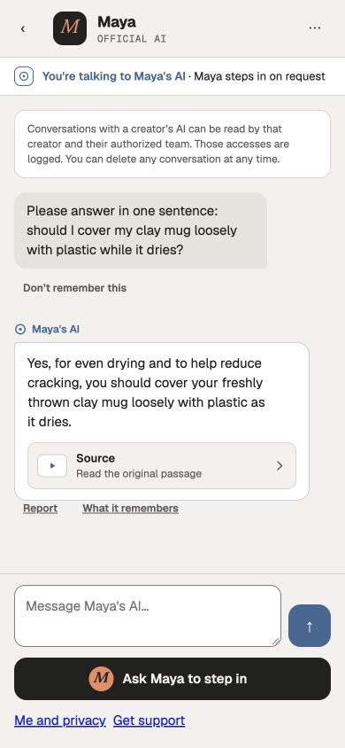
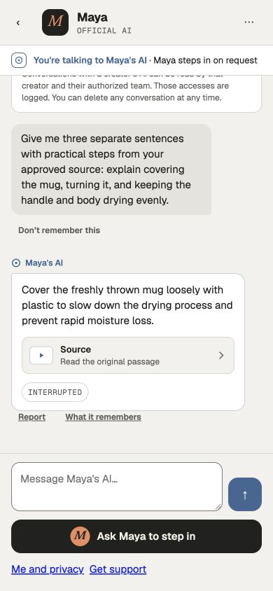

# Canonical generation and real browser journey

[PR #334](https://github.com/WangPantopus/creator-platform/pull/334) follows merged PR #132 (`68f6a395`). It establishes the explicitly configured fictional development path through the canonical compiled server. It does not approve production identity/provider terms or certify the product latency SLOs.

## Implementation

- The canonical host owns worker startup, an immediately revocable admission gate, the original abort signal, complete provider/journal drain, and worker pool closure. Missing, wrong-role and remote worker URLs refuse before the listener starts. Standalone worker startup still refuses unowned composition.
- Creator setup can continue from a signed-in account without a creator profile. Studio uses the canonical actor while retaining account/session/creator checks for local state.
- Public AI uses the original narrow identity and Trust consumers. Reviewed additive 0235/0236 connect the existing sources without rewriting applied migrations.
- Idle ingestion discovery no longer takes the workspace write lock every second. The actual ingestion transaction still rechecks ownership, revision, lease and model. Opening a generation purpose retries only original 55P03 contention, at most five attempts, after complete rollback; it never replays its business callback or extends a lease.
- Current catalogue reads are combined into one statement; all original installation, authority and consumer predicates are preserved verbatim ([comparison](combined-catalogue-equivalence.json)). Lifecycle function hashes are computed over the same current UTF-8 bodies inside PostgreSQL. Only plans are reused; no authorization result is cached. Redundant metadata/finish reads are removed while the original writer retains checks before and after append.
- Reviewed additive 0237 repairs zero-output unknown-cost terminal recovery; additive 0238 also handles already approved ordinary sentences whose reply cost remains unknown. It checks the sealed complete journal, exact family and durable output provenance, closes the conversation, and retains unknown costs plus the full original reservation. Known outcomes still settle the original weighted amount. Applied 0215, permissions and clocks remain unchanged.
- Cooperative provider and SQL cancellation preserve the host's original abort identity after awaited usage completion and connection cleanup. SQL cancellation during a read and between reads both pass against real PostgreSQL; statement timeouts and distinct callback failures remain errors. Actual cancellation/socket/rollback/release failures are retained, and an uncertain original connection is still destroyed before release.
- Fan offline-cache renewal backs off when its issuer is unavailable. New text follows the reading position above the sticky composer; scrolling up is preserved. At narrow effective widths the enlarged layout reflows without horizontal overflow and unpins header/footer so they do not consume the reading area.

## Actual operation

Separate creator and fan browser sessions used the authorized fictional Maya source, actual ingestion/provider calls, six-case evaluation, publication, public entry, synthetic sign-in/profile, processor disclosure, and real conversation submission. The citation opened the approved 545-character original passage. Human takeover/handback changed the fan identity strip and composer with explicit authorship. These were idle control transitions, not in-flight cutoff proof.

[All preserved attempts and final custody](canonical-final-custody.json) include failures. In the final compiled untraced run, generation `077525f6-a141-4ac3-ad71-1780bc6089d0` delivered one approved cited sentence, four known provider calls totaling **2655 microdollars**, and **3 settled allowance units**. Earlier canonical browser generation `cf5c730a-c3d5-44c1-9098-cd734acc5632` delivered two frames with 3147 microdollars / 4 units. The traced longer final-copy run reached its original 60-second lease: three delivered frames remain **interrupted**, and 3886 known microdollars settle 4 units. It is not recorded as a successful complete generation.

[Active shutdown](active-shutdown.json): the actual compiled process received SIGTERM while a newly committed provider call was admitted. It exited 0 after the usage record closed with unknown cost. Restart after the unchanged lease recovered a failed zero-output conversation. Exactly one provider call remains; no replay occurred. The original 60-unit hold stays reserved, settled amount and settlement clock remain null. Earlier unknown-cost attempts remain preserved. This verifies terminal recovery, not late-cost financial reconciliation.

The final [partial-output interruption](partial-active-shutdown.json) stops the compiled backend only after the mobile fan sees an approved sentence and the original reply call is still admitted. SIGTERM exits **0**. All five provider records complete, two with unknown costs. Restart waits for the original lease, retains the exact sentence/citation provenance, marks it **Interrupted**, and keeps all 60 units reserved with null settlement amount, reference and timestamp. Provider records compare byte-for-byte before and after recovery: no replay. The subsequent idle shutdown also exits 0. The earlier partial-output run exposed the SQL cancellation error and is preserved as a failed shutdown observation; its data was never reset. [Diagnostic before/after and negative cases](sql-cancellation-diagnostics.json) are real read-only PostgreSQL cleanup probes, not substitute user-journey evidence.

## Timing and design

[Measurements](latency.json) are individual development observations, **not p95/p99 or production acceptance**. The concise run's HTTP acknowledgement took 1.143s; first reply text entered the DOM at 29.813s and terminal text at 35.214s. The corresponding accepted-to-durable-output/terminal times were 24.631s / 29.521s. All exceed the intended 300ms acknowledgement, 2.5s warm/4s cold first-visible and 8s completion targets. One idle takeover observation was 634ms; handback 492ms, including automation invocation overhead.

The earlier measured run revealed text behind the sticky composer. After correction, a [new complete mobile stream](post-scroll-visible-timing.json) measures **2.555s acknowledgement, 27.562s first fully visible sentence, and 32.618s terminal text** from the browser request. The first text ends at 485.5px, above the composer at 647px; client and scroll widths are both 390px. This reply completes and settles 2,584 microdollars to 3 units. These are individual observations and still miss the product targets. Long generation row locks also cause brief reconnect/conceal transitions; ordered recovery works, but latency and connection continuity remain unqualified.

[Design observations](design-observations.json): actual desktop and 390px Light/Night screens preserve Geist AI typography, AI/human distinction, source navigation, interrupted/unavailable states, and the human request action. At 390×844 the latest complete article ends at 631px and composer starts 647px. After correction, 200% CSS zoom has 390px client and scroll widths; header/footer enter normal flow. This is reflow inspection, not OS font-size or physical-device certification. Temporary browser overrides and timing observers were removed.

## Migration and preservation

[Public AI closed review](public-ai-closed-review.json), [negative guards](public-ai-guard-review.json), and [activation](public-ai-activation.json) preserve original 102 history, adding only 0235/0236. [Recovery closed review](recovery-closed-review.json) compares two independent 104 states, with/without incoming Growth membership: no existing role capability or business data changes, all six digests restored after rollback, only the expected financial function fingerprint changes. [Recovery activation](recovery27-activation.json) applies only 0237 after an independently verified backup/restore. [Final independent restore and replay](recovery-final-replay.json) preserve all six digests, including real known/unknown outcomes, at 105 registrations; replay applies zero migrations. Ordinary migrations apply nothing. The [0238 closed review](partial-recovery-closed-review.json) repeats both independent105 catalogues with/without incoming Growth membership; only the expected financial definitions change. [Activation](partial-recovery-activation.json) advances105 to106 through the original operator with an independently restored backup. The [post-operation independent restore and replay](partial-recovery-final-replay.json) preserve all six digests at106 and apply zero migrations.

[Final preservation](canonical-partial-final-custody.json) verifies the original archive ledger/schema/sequences/data and all 658 legacy usage rows unchanged across the 17 preserved application/restore copies (19–29 and 31–36). Every pre-existing role's attributes/memberships match; the reviewed permanent public-AI purpose role remains. Temporary login/passwords are removed and application copies are traffic-closed. Private full dumps, SQL traces and credentials stay outside the repository. Failed attempts and unknown holds are not reset.

## Validation and limits

Backend shipping build, web production build, web typecheck, scoped lint and all 17 existing contract/lifetime tests pass. [Startup refusals](generation-startup-refusals.json) verify invalid worker configuration never starts admission. The web production build is valid; local HTTP synthetic sign-in was exercised in Next development mode because production correctly refuses that redirect/cookie configuration.

Remaining: latency and continuous connection qualification; uncertain-send idempotency, in-flight takeover, revocation and memory-consent journeys; late unknown-cost reconciliation; complete Studio and physical-device acceptance; production identity/provider/licensing. Existing retention/purge, human signing, Commerce, calls and Growth release work remains in the [continuation map](../../../../docs/operations/project-continuation-2026-10-07.md). The operated fan uses the free 24-hour grant, so paid-membership first-use and shared-pass settlement remain unqualified. One final reply adds a drying explanation absent from the original passage; successful classifier/citation checks do not establish semantic grounding acceptance. Tighten that evaluation before release. No policy, deadline or financial outcome was weakened to claim acceptance.

The first hosted web/backend run found formatting in `privacy-family-catalog.ts`; a formatting-only follow-up corrects it. Read current-head hosted checks separately from the local operation evidence above.
