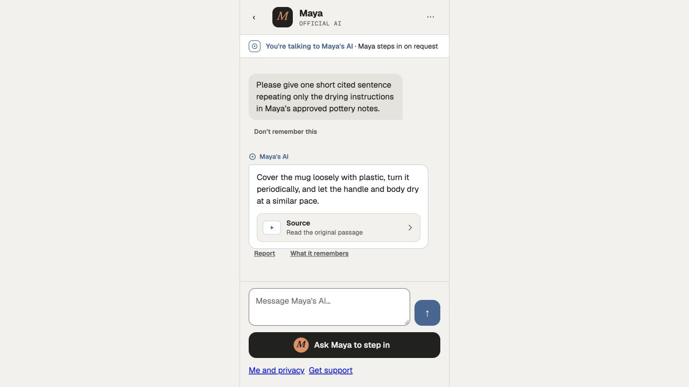
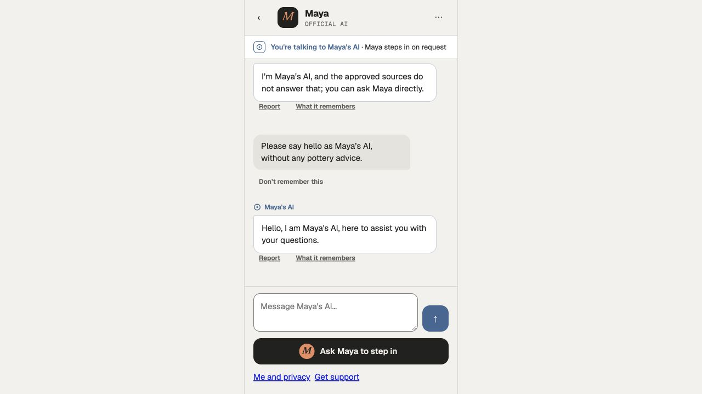

# Published engine compatibility and remaining latency

October 8, 2026 continuation of [#335](https://github.com/WangPantopus/creator-platform/pull/335), following the [context-budget evidence](../../2026-10-07/generation-context-latency/README.md). This qualifies an incremental change for review; it does not qualify target latency, existing-version upgrades, or production generation. Hosted checks must pass at the pushed head before merge.

## Deployment behavior

The new context-tokenizer fingerprint previously made published revision 12/13 creators unavailable. The host now selects their actual historical implementation under the exact original model, rates and policy configuration. New drafts and first publication use revision 14. Unknown engines or changed model configuration still refuse. No stored fingerprint or evaluation is rewritten, and both live generation paths select the saved engine. Historical engines share the current per-creator concurrency bound.

This intentionally preserves historical limitations: revision 12 has its original grounding behavior; revisions 12/13 retain the old byte-counted context budget. They do not acquire new behavior without an evaluated upgrade. Shadow replay now selects the actual published baseline and refuses unavailable engines before collecting fan-derived material. A new comparison fingerprint binds the draft and live identities, so old passes made with the draft engine on both sides cannot authorize publication. The privacy-safe paraphrase feed remains unconnected; no samples were invented and no upgrade was qualified.

- [Historical differential evidence](historical-engine-equivalence.json): fourteen cases against actual revision 12 (`d165d3116`) and 13 (`eb714387d`) source, pinning instructions, schemas, context, routes, outputs and audit proposals. Scripted unit-test model/ports do not count as live authorization or provider acceptance. Durable tests are in `apps/backend/tests/historical-pipeline.test.ts` and `shadow-compatibility.test.ts`.
- [Actual saved publication matching](published-engine-compatibility.json): read-only checks select exact revisions 12, 13 and 14, with matching compiled identities.
- [Live operation](operation.json): the final compiled host serves the existing revision 13 publication on copy 43 without republishing. A real browser greeting completes four provider calls, 1,092 microdollars and two settled units. This is compatibility evidence, not useful-knowledge latency qualification. All earlier seven generations, messages, provider records, reservations and the evaluation remain unchanged.

## Equivalent catalogue optimization

Combined PostgreSQL privilege checks skip exhaustive expansion only for empty privilege sets. Every execution still reads the current catalogue, including PUBLIC/inherited/table-wide and column-only grants, relation owners and RLS policy. Empty arrays and nulls retain the original query shape; reviewed checksums and source registrations are unchanged. No catalogue result is cached across purposes, and no purpose or worker deadline is widened.

Both [purpose](purpose-catalogue-equivalence.json) and [financial](financial-catalogue-equivalence.json) tests use actual PostgreSQL on labelled copy 44. Thirty alternating before/after pairs follow warmup. Complete results match; sixteen transactional table, sequence, column-only, PUBLIC, inherited, view, partition and RLS drift cases remain visible to both queries. Rollback restores the original state.

| Query/role                   | Before median | After median |
| ---------------------------- | ------------: | -----------: |
| Input purpose                |       9.299ms |      8.172ms |
| Metadata purpose             |       8.789ms |      7.698ms |
| Journal purpose              |       9.675ms |      8.836ms |
| Output purpose               |       9.445ms |      8.330ms |
| Worker purpose               |       8.326ms |      7.290ms |
| Financial terminal catalogue |     491.870ms |    344.590ms |

These are isolated query improvements, not end-to-end latency claims. An earlier instrumented request window includes 512 purpose scans, 715 W1 scans, 366 owner checks, four financial catalogue scans and 656 scope checks; background overlap and instrumentation prevent adding those timings into a causal wall-clock attribution. Repeated current-check work remains a substantial follow-up.

## Browser outcomes and limits

The final compiled revision 14 run on copy 45 delivers: “Cover the mug loosely with plastic, turn it periodically, and let the handle and body dry at a similar pace.” It preserves citation, AI disclosure and the human action. The whole bubble is above the composer in the observed 1280×720 browser.

- [Final measured browser run](fan45-compatibility-compiled-timing.json): acknowledgement **3.767s**, first fully visible useful sentence **26.992s** from click. Server acceptance-to-first-storage **20.371s**, acceptance-to-terminal **23.820s**. Four completed provider calls cost **2,425 microdollars**, settled to **three units**.
- [Earlier guarded fallback](fan45-current-fallback-timing.json): acknowledgement 1.947s, fallback visible 26.948s. The durable guard category is `citation_invalid`. The rejected proposal was not captured, so no exact cause or false-positive claim is made. This is a **usefulness failure**, not a successful first-useful-sentence measurement. Its four calls / 4,032 microdollars / five units remain recorded.
- Two source-host diagnostic requests subsequently deliver supported cited answers, including the repeated prompt. Actual guard output contains complete spans and exact source quotes. The final compiled run also succeeds; guard requirements were not relaxed to achieve those results.

The Next development frontend, different saved history, local cold startup and stochastic provider calls make these individual observations unsuitable as a controlled end-to-end comparison or p95/p99. The earlier 22.512s observation is retained, not replaced by a claimed improvement. The 300ms acknowledgement, 2.5s warm/4s cold useful sentence and 8s completion targets remain unmet. Grounding reliability, representative latency, privacy-safe upgrade replay and production provider/licence qualification remain work to do.

## Accounting, shutdown and preservation

Copy 45 now has seven delivered generations, 28 completed known-cost calls, 24,102 microdollars and 29 settled units. The four new attempts add 16 calls / 12,648 microdollars / 15 units. Original twelve usage rows remain exact. An idle compiled restart preserves versions, evaluation, messages, generations, reservations and all 28 usage rows, with usage digest `899842c1e7e8cb37dfa8e0992335c4236e4d003e5c2774dfbcc9066e32bd15f7` before and after. The new revision 13 compatibility run also settles normally. This continuation does not repeat the prior active-provider interruption qualification; those failed runs and unknown-cost holds are preserved in the earlier evidence.

[Final custody](final-custody.json) checks the original archive hashes, all 658 original usage records in each of 27 closed copies, preserved failed attempts and the unresolved-cost hold. No historical financial state, lease or clock is rewritten. Owned app/web processes exit normally, test tabs close, temporary passwords and the temporary Growth role are removed, and the owned Docker container stops. The primary checkout remains untouched.

[Local validation](validation.json): backend production build and typecheck, 38 passing tests, scoped lint/format and the differential/database checks above. Nine existing PostgreSQL integration cases skip locally because the preserved archive is not a disposable Foundation fixture; hosted CI supplies that fixture. Source hashes identify the final local code used by the compiled operation, with the two later-added test files included separately from the built server.
