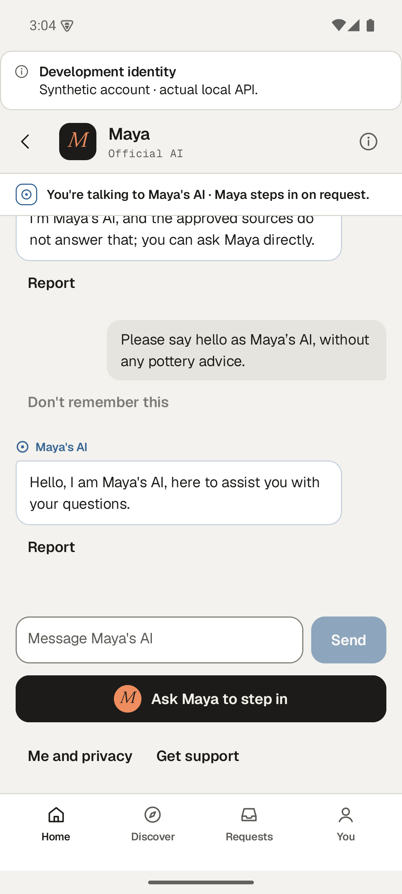
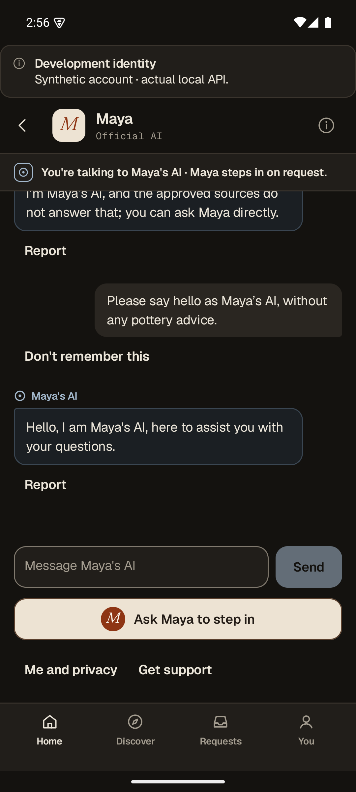
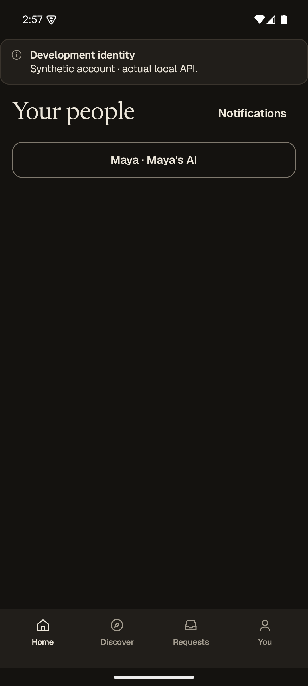
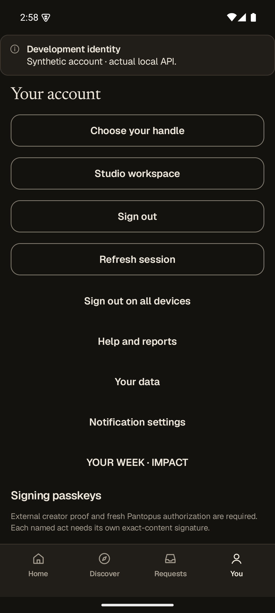
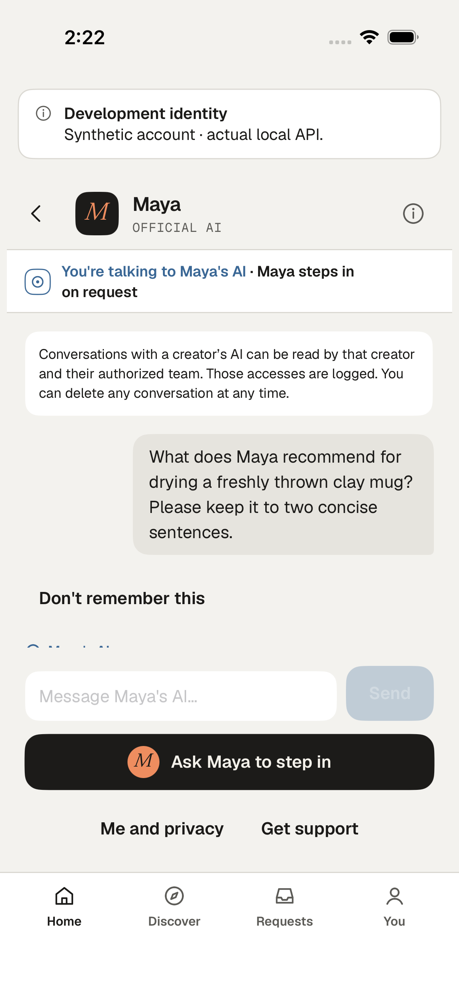
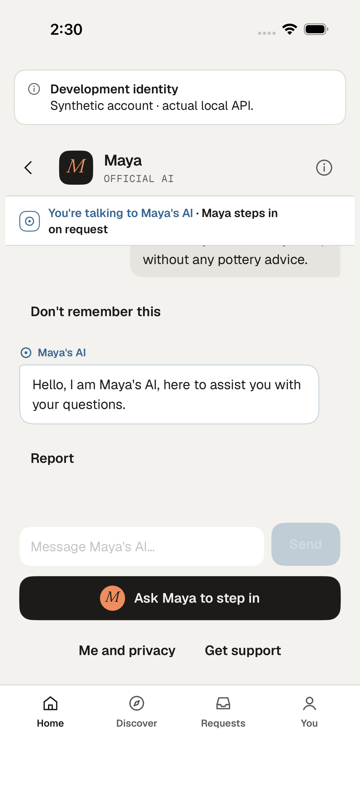
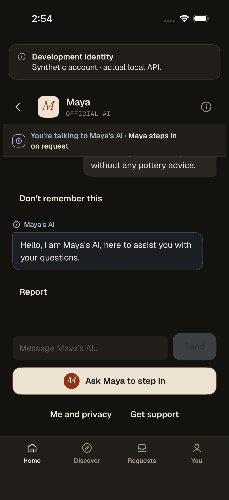
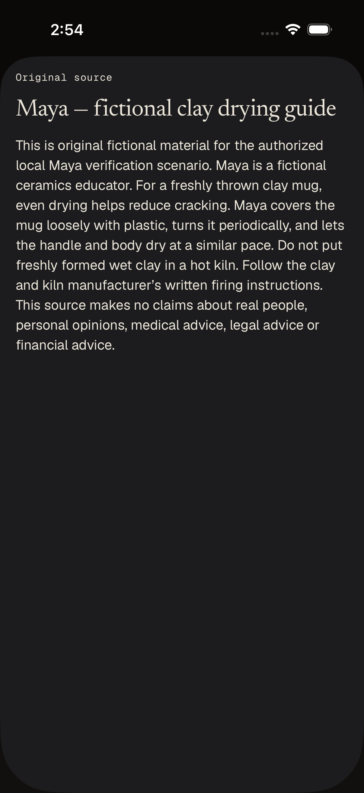
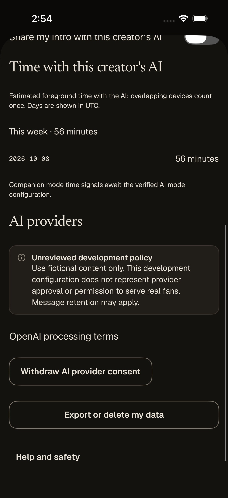
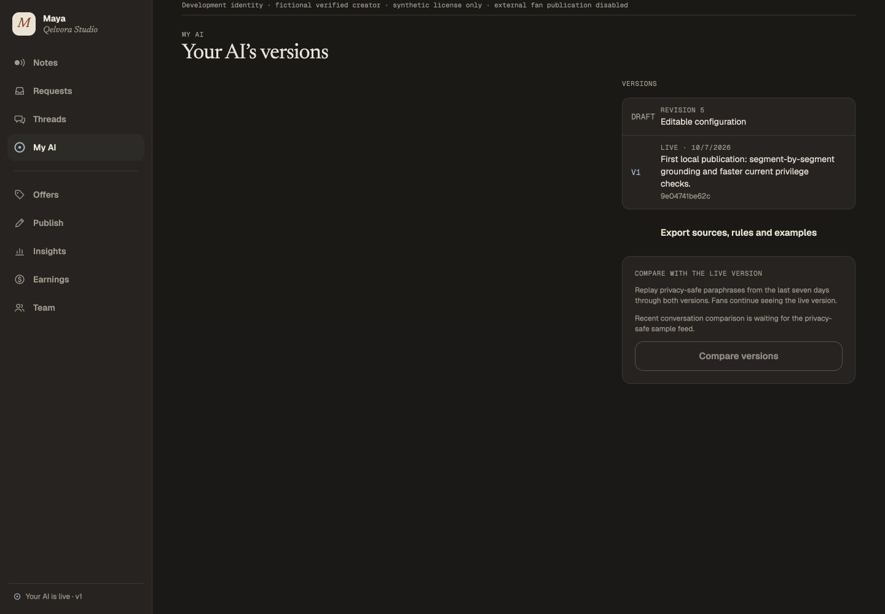

# Connected native conversation continuation

This milestone follows merged [#336](https://github.com/WangPantopus/creator-platform/pull/336)
at `78c42fc3a5051b259473ad1e598e140e6391d210`. All five post-merge Foundation
jobs passed in [run 37755801357](https://github.com/WangPantopus/creator-platform/actions/runs/37755801357).
The [complete finish plan](../../../../docs/operations/product-finish-plan-2026-10-08.md)
remains open, including the trusted shadow producer and actual existing-version
upgrade.

## What the real apps exposed

Both native conversation screens opened at the oldest loaded message. The latest
reply was below the visible conversation, even though the composer was ready.
iOS now uses the native bottom scroll anchor. Android follows the current reply
until the reader scrolls away, including accessibility scrolls, and resumes
following when the fan sends. A completed send no longer forces an iOS reader
back down after they have moved into earlier history.

Android's connected composer also lacked the designed visible input label,
rounded surface and border. It now uses the existing Composer tokens and shows
the current recipient while empty. The reference is
[`Thread.dc.html`](../../../../design/phase4a-fan-core/Thread.dc.html) and its
shared Composer, rather than a new visual system.

The cold-restart operation found that Android retained the account but lost its
destination. Its saved navigation now contains only a bounded path and account
ID encrypted by the existing issuer-specific Android Keystore key, with separate
authenticated data from the credential. It restores only after a successful
canonical session read, checks the original credential under the storage lock,
and gives explicit links, notifications and activity restoration precedence.
Query strings and feature payloads are not saved. Account replacement, logout
and corrupt credentials remove navigation. A guarded credential rotation keeps
it; a replacement shell owns subsequent navigation writes. A route changed while
the canonical account is unavailable remains pending until a successful read
confirms the current credential, without rewriting navigation every refresh.

An immediate sign-in attempt during sign-out cleanup could previously appear
enabled but do nothing. The welcome action now reflects the original shell's
busy/purge lifetime on both native platforms.

## Operation boundary

The apps use the original preserved copy 43 and its actual local backend,
genuine development identity continuations, OS credential storage and scoped
API clients. The existing fictional fan is `clay_fan_dev`; Maya still has the
same historical revision-13 publication. The opt-in XCTest and Android
instrumentation journeys create no accounts, profiles, consents, publications,
messages or provider responses. They operate existing app controls and retain
screenshots and accessibility trees. No unit tests were added.

The initial receipt and the [final read-only receipt](preserved-operation-summary.json) both retain eight
delivered generations, 33 known provider usage records, 24,985 microdollars and
31 settled allowance units. The usage digest remains
`85268d72b558494c003f8cffa960c81a39e08089aca60afeb68eeabc37ae6cfd`.
Normal sign-in/out and foreground-presence records are real new operations.
No clock, historical publication, applied migration or unknown-cost hold is
rewritten.

## Evidence and limits

- iPhone 17 Pro simulator, iOS 26.5, Xcode 26.5, x86_64 host.
- Dedicated Pixel 7 Android emulator, API 35 Google APIs x86_64, Java 17.
- Running web Studio at 1440×1000: the existing live publication is visible;
  Sources → Versions shows the comparison gate waiting for its trusted feed.
  The overview uses the compact design on desktop, but the editing controls
  are reachable. Desktop entry navigation remains a separate design refinement.
- Initial Android harness failures (an unnecessary scroll action and a check
  before privacy loading completed), actual lost-route behavior, a sign-out
  timing failure and an emulator/session-read timeout are retained in the local
  operation directory. They are not relabeled as passes. The same AVD was
  restarted without clearing its data; the original encrypted session restored.
  After the iOS run, its dedicated simulator was shut down to release a runaway
  simulator media-analysis process. No unrelated simulator was stopped.

The development operation directory is
`/Users/yingpengwang/.codex/visualizations/2026/10/08/01a11aa9-c32c-7821-bcaf-6675731d1ad9/native-e2e`.
It retains complete build logs, result bundles, original attachments, failed
attempts, tool versions and the incidental Xcode dependency-resolution output.
The preserved backend copy remains open for the authorized continuation.

This increment does not qualify new native provider sends, interrupted streams,
largest text, keyboard transitions, recording on physical devices, paid store
callbacks, production identity or the complete native product. Those acceptance
items remain in the finish plan. Native read/restart checks and historical
provider receipts are distinct evidence.

| Operated build | Result | Coverage |
| --- | --- | --- |
| iOS final run 04, Night | Passed, 48.473s | Latest reply above composer; stable history through periodic refresh; citation; real process restart; current consent |
| Android run 07, Night | Passed, 207.995s | Cold restore after same-AVD reboot; stable history, citation and consent; recreate; explicit Home; account replacement |
| Android final run 08, Light | Passed, 170.888s | Same journey, including replacement-account profile label; final pending-route persistence source |

[Source and capture hashes](validation.json) identify the operated revisions.
The earlier iOS Light capture is run 02, after the anchor repair and before the
pending-key/welcome-action refinements. Final iOS source is covered by Night
run 04. Android Night run 07 precedes the pending-navigation retry refinement;
Light run 08 covers the final source. New native sends and deliberate in-flight
credential-rotation navigation remain separate acceptance work.

## Reproduction

The two new files are opt-in app journeys, not unit tests. CI without an explicitly
selected development backend skips them. Both use ordinary visible sign-in and
existing API controls; they must never point at production accounts.

For iOS, build the XcodeGen app with normal simulator signing, then run
`QelvoraUITests/ConnectedJourneyTests` using `xcodebuild test-without-building`.
Forward `QELVORA_E2E_API_URL`, `QELVORA_E2E_THREAD`, `QELVORA_E2E_ACTOR`,
`QELVORA_E2E_CREATOR`, `QELVORA_E2E_LATEST_TEXT` and `QELVORA_E2E_APPEARANCE`
through their `TEST_RUNNER_` environment names. The operated simulator is
`D5ED8A7C-924E-4F1E-AC35-DB0FACF1E1B0`; the original result bundles preserve
all screenshots and accessibility trees.

For Android, assemble/install the app and instrumentation APK without deleting
app data. Run `com.pantopus.qelvora.ConnectedJourneyTest` with the AndroidJUnitRunner,
setting `journeyApiUrl`, `journeyThread`, `journeyActor`, `journeyCreator`,
`journeyLatestText` and `journeyAppearance`. `journeyPhase=resume` omits any forced
return path. The optional `journeyOtherActor` operates real sign-out/sign-in and
`journeyOtherAccountLabel` verifies the replacement profile state. The operated
values were existing Development actor three, Maya, and Development actor one
with “Choose your handle”; no new profile was created.

Use the original copy-43 custody helpers and its current running port, not a
reset/reseed. Read-only operation receipts and a source-hash manifest accompany
the selected captures. Full logs and failed attempts remain in the operation
directory named above.

