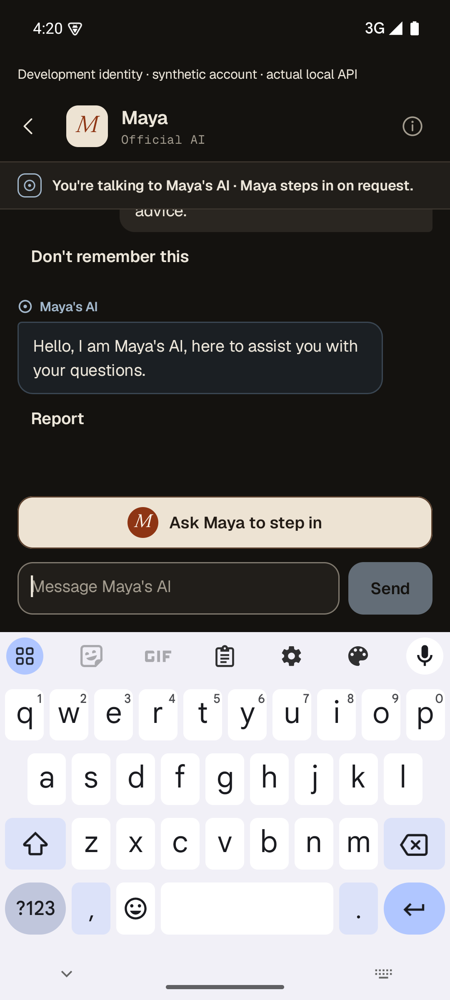
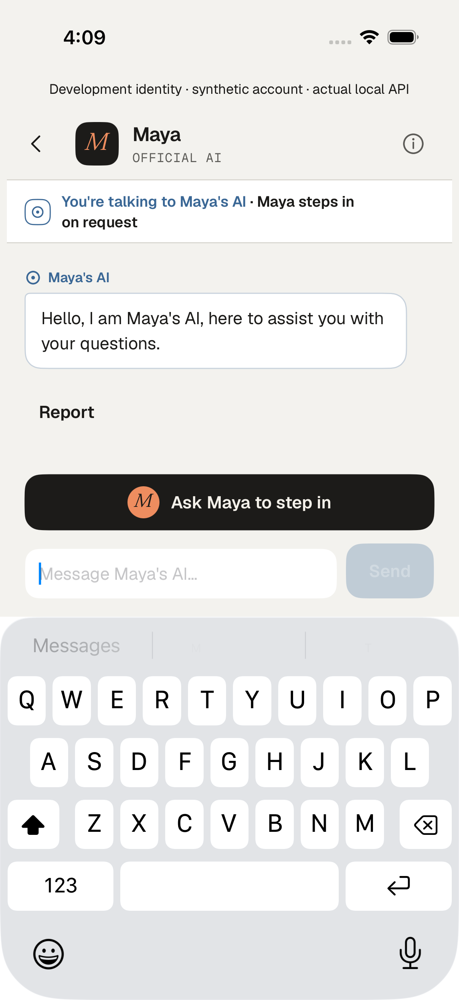
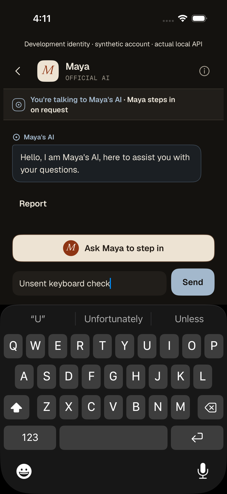

# Native send, keyboard and recovery milestone

Real sends now complete in the launched iOS and Android apps, preserve a newer
unsent draft through reconnection, and keep the latest reply and human action
visible above the software keyboard. This follows [#337](https://github.com/WangPantopus/creator-platform/pull/337)
and is a bounded increment of the [complete finish plan](../../../../docs/operations/product-finish-plan-2026-10-08.md).

## Changes and actual acceptance

- Keep the Android composer in the same composition when IME insets change;
  moving it between the footer and list destroyed focus and immediately hid the
  keyboard. Larger text/short physical windows retain scrolling controls.
- Follow the [thread reference](../../../../design/phase4a-fan-core/Thread.dc.html)
  and [Composer specification](../../../../design/design-system/project/components/Composer/README.md):
  no global tabs within a thread; human action above the field; compact labelled
  development notice; secondary footer links while the keyboard is closed.
  Conversation privacy remains available in the header while editing.
- iOS follows the latest reply after the keyboard actually opens. The default
  scroll anchor alone did not follow viewport contraction.
- Both apps clear only the submitted draft when a delayed acknowledgement arrives.
  Android Refresh restarts its connection; failed metadata/snapshot refreshes
  propagate to the connection owner for a fresh authorized reconnect.
- The original two-second realtime authority deadline closes with retryable 1013
  instead of policy-denial 1008. Actual denials remain denials; no timeout or
  authorization gate was relaxed. DEBUG diagnostics contain fixed classifications
  and numeric codes, never credentials, raw errors, payloads or actor IDs.

| Actual operation | Result |
| --- | --- |
| iOS send 03, Light, final product source | PASS, 46.577s; new draft retained through socket interruption, reply and human action visible with keyboard |
| iOS keyboard read 03 / 04 | PASS, Light 11.548s / Night 11.272s; actual saved reply, no provider call |
| Android keyboard read 02, Light | PASS, 23.096s; reply and human action visible with keyboard open and after hiding |
| Android send 06, Night | PASS, 50.457s; reply/draft/keyboard checks; account warning still visible at capture |
| Android send 07, Night, final source | PASS, 58.313s; additionally waits for account warning to clear following genuine session reconfirmation |
| Actual web fan session | Same native sends/results visible in the retained conversation |

Android send 07 observed two 1013 authority-deadline closes and an identity
transport failure. A later canonical session read reconfirmed identity and the
warning cleared (20.307s after the logged transport failure). The UI test includes
that recovery; this does not establish a universal recovery-time bound or the
sole cause of earlier failures. iOS send 03 recorded socket code 1005/POSIX 57 and
recovered; its server close reason was not established.

## Preserved failures

| Operation | Actual outcome |
| --- | --- |
| Android 01, generation 9 | Delivered historical revision-13 fallback to a supported pottery question; native view lost. Failed native acceptance and failed useful answer. Same result observed on web. |
| Android 02, generation 10 | Delivered greeting; native connection closed with 1008. Original server reason not captured. |
| Android 03/04, generations 11/12 | Delivered; 03 observed actual 1013 deadline and recovery/new draft. Tests failed while the OS keyboard-hide animation was still settling. |
| Android 05, generation 13 | PASS 48.578s and separate keyboard read PASS 14.223s; predates final layout, account warning persisted during that run. |
| iOS 01, generation 14 | Accepted, failed with no provider call; original authority/thread-lock/terminal attempts failed before original worker recovery at 224.983s. Exact sealed no-request receipt released allowance at zero units. |
| iOS 02, generation 15 | Delivered and draft retained; harness failed editing the recreated field without tapping it. Final harness uses the actual touch target again. |

No provider was replayed to repair generation 14; no lease, clock or cost was
inferred/rewritten. The strict all-delivered recorder correctly refused the mixed
outcome. A separate read-only recorder explicitly checks that exact failed
operation and its zero-unit release. All other reservations remain consumed with
actual delivered output. Earlier unknown-cost holds in other preserved copies
are untouched.

The dedicated iOS simulator's mediaanalysisd consumed nearly nine CPU cores during
iOS 01. Later functional operations suspended only that owned process, then
resumed it before simulator shutdown. [Environment custody](operation-environment.json)
records this adjustment. It is not a representative performance profile or a
proven sole cause. The first backend launch refused a descriptive dirty release
label; it was relaunched only after committing the exact backend revision.

## Data and runtime custody

[Final receipt](final-receipt.json): copy 43 has **18 generations: 17 delivered,
one failed without a provider call; 69 known-cost usage rows, 36,815 microdollars,
51 settled units**. Usage digest:
`9b6d528acbc4a957ddfcdee0beb43e064668d655ae717ce41c0cd006285af345`.
The original eight generations/messages/reservations, all 33 usage rows,
publication and evaluation [compare exactly](original-history-preserved-final.json).
The saved engine is still historical revision 13; this is not an upgrade.

Backend is compiled from `9f1a50eb4c3c2c85a63c5afd2627cdd657db4cf2`, port 57304.
Web port 3119 uses the same canonical backend for Trust. The development Ops actor
was denied metrics without current supervisor authority; that gate remains.
No new Ops role, provider consent, publication or retention policy was issued.
#337's five post-merge jobs passed at `715cc0728d417f40e97d41eec64cab6e4121cd6f`.

Original xcresults, APKs, screenshots, logs, source snapshots and private usage
rows remain under
`/Users/yingpengwang/.codex/visualizations/2026/10/08/01a11aa9-c32c-7821-bcaf-6675731d1ad9/native-e2e`.
[Artifact hashes](verification-manifest.json) bind the final source/build evidence.
Only explicit live-journey E2E tests were added; no new unit tests.

## Remaining acceptance

This proves the operated native send and keyboard/recovery paths. It does not
qualify useful pottery responses, production latency, largest native text,
physical devices, deliberate access revocation/takeover, paid grants, the missing
trusted comparison producer or existing-version upgrade. iOS send 03 took
22.276s from acceptance to first stored output; Android 07 took 21.751s. These
are stored-output times, not visible-first-sentence or percentile results. The
[full ten-milestone plan](../../../../docs/operations/product-finish-plan-2026-10-08.md)
continues unchanged.
