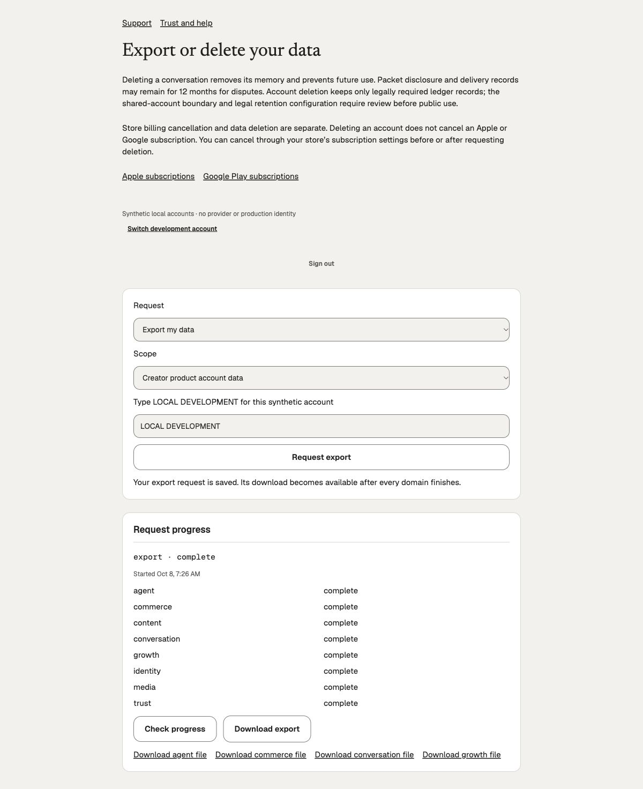

# Export attempt recovery — October 8, 2026

Source commit `5bd6b6215f172344528d2735e61705a4e079fc69` adds durable attempt
metadata before the private store writes any export bytes. Discovery is bounded;
original task authority decides whether to wait, retain an acknowledged artifact,
or remove an abandoned attempt. The pending comparison lifecycle is still
unregistered and uncomposed. Actual app storage and synthetic source recovery
are distinct evidence below. No new unit tests were added.

## Behavior and original authority

The private marker contains the exact job/account/domain, original lease token,
snapshot, content type and opaque file identity. It is never exported to users.
Abort removes payload paths before forgetting the marker. A separately authorized
removal writes and syncs a durable removal marker before unlinking all owned
attempt paths; a suspended predecessor cannot recreate the artifact at sealing.
Repeated cleanup is safe, including interrupted marker writes. Successful
acknowledged artifacts can forget discovery metadata without deleting content.
The normal expiry sweep removes old markers only when payload paths are absent.

Additive pending SQL takes the actual original job/task row locks. A live source
holds the same task and blocks removal even after its lease expires. A current
running lease waits; an exact completed/current captured artifact is retained;
a previous or expired attempt can be removed while the task remains locked.
Physical I/O settles before the same client acknowledges. Pre-activation completed
exports without provenance are left for explicit legacy review. File age is not
permission to delete. New source SHA-256:
`f99563564a82d3ba6145b82760e177ae91b2c1fd0538a4c4187b0cae5de28380`.
The prior artifact SQL remains byte-for-byte unchanged.

## Isolated crash and source operation

[Operation 08](graph-operation-08.json) runs against fresh schema-only database
`creator_comparison_artifact08_20261008` on the isolated 58297 source-review
container. Earlier databases 05–07 and their evidence remain unchanged.
All thirteen cases pass, including the preceding source/withdrawal/expiry cases,
actual SIGKILL of separate synthetic writers before and after seal, discovery
from a fresh store, actual elapsed lease expiry, retention of the original
completed file, delayed predecessor refusal, and an original held source that
correctly prevents recovery until its rejected COMMIT settles. No app host,
original export or original database was killed/reset for these crash cases.

[Preparation](preparation-operation-08.json) records nine functions, one table,
six relevant triggers and 52 dependencies. Three search paths produce the same
metadata hash and are restored. Runtime preparation still refuses the pending
sources. Neither this digest nor the isolated operation is registry approval.
Scripts, captured SQL bytes and private synthetic files remain in
`/Users/yingpengwang/.codex/visualizations/2026/10/08/01a11aa9-c32c-7821-bcaf-6675731d1ad9/comparison-artifact-review`.

## Actual launched web export

The backend was built from the exact source commit under the shared build lock.
After a [normal owned idle stop](shutdown-artifact-attempt-5e5cd-stop.json), it
launched on 57304 with the original copy 43 environment. Web remains on 3119.
Original creator export 61e07c91 was preserved. Through the real browser, the
existing fan, Development actor three, requested its first copy 43 account export:
`f6a7410b-7db9-4da6-a4ca-901d7a90a317`.

The [request completed all eight domains](fan-attempt-export-completed-01.json).
Agent's first attempt correctly waited on the original completed Conversation
accounting boundary (`accounting_boundary_pending`); its automatic second attempt
completed. Other domains completed on their first attempt. This is preserved
recovery evidence, not a claim that the first attempt succeeded.

The manifest and all four [actual browser downloads](fan-attempt-downloads-01.json)
match saved byte counts and SHA-256 digests. Each saved artifact has matching
private 0600 attempt metadata. Agent contains no owned creator data (39 bytes);
Conversation contains the actual 198,980-byte populated family, Commerce 12,091 bytes
and Growth 541 bytes. Commerce is the existing trial/grant/reservation history,
not paid-membership acceptance. Populated binary Media remains unqualified.
Comparison lifecycle SQL was not applied to copy 43, so no comparison source or
source-withdrawal operation is claimed by this browser journey.

[Exact before/after custody](fan-attempt-export-custody.json) preserves the
publication, evaluation, all 18 generation records, messages/reservations and
69 usage rows: 36,815 microdollars and 51 settled units. No provider use occurred.
The owned native devices remain shut down with state preserved; this increment
does not claim new iOS/Android acceptance.

Private downloaded payloads, full receipts and logs remain under the sibling
`native-e2e/private` directory. Runtime launcher:
`native-e2e/launch43-backend-artifact-attempts.mjs`; log:
`native-e2e/backend-artifact-attempts-01.log`. Normal shutdown succeeded at the
original idle SQL boundary; the earlier unexplained shutdown failure stays open.
Backend TypeScript, scoped lint/format, diff check and shipping build passed.

## Remaining work

Complete original comparison source/read and provider admission, explicit actual
consent/sanitizer operation, read/publication fences and composition. Allocate
and independently review the full executable and restore graphs before enabling
pending SQL. Include the new artifact provenance in complete Trust export and
retention/deletion; review legacy exports explicitly, preserve exact original
boundaries, and qualify recovery of compiled prepared owners and held I/O
cancellation. The existing missing-feed and Agent comparison-export gates remain.
All ten product finish milestones remain active, including real revision 13→14
upgrade and the later full cross-platform, latency, commerce, media and pilot
acceptance.
