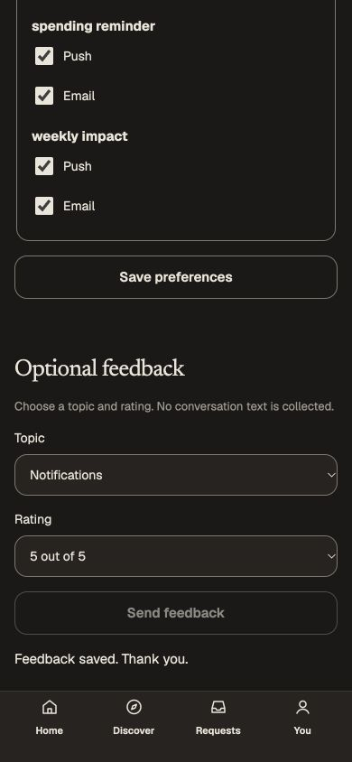

# Optional notification feedback survives uncertain saves — October 6, 2026

The original notification feedback form generated a new database row on every retry and retained a stale success message after editing. Personally reproduced an unconfirmed save followed by an unchanged retry: two actual unscored feedback rows were committed. The initial rating selection occurred before hydration and was excluded as rating evidence; the observed duplicate payloads were both unscored. No response was fabricated.

The mounted original-session form now retains one retry key and immutable answers until edited. Controls freeze while saving, failures retain that intent, confirmed unchanged submissions disable repeat send, and editing clears the old acknowledgement and starts a new intent. Uncertain failures use the existing shared feedback-confirmation copy. No layout or CSS changes were made; DI16's missing notification-control artboards remain unresolved.

The existing Growth endpoint accepts an optional UUID retry key. Its existing immutable feedback row is the durable outcome, with an ID derived from the canonical account and key. Unique insertion serializes concurrent duplicates; a separate READ COMMITTED read compares the committed answers, refusing changed reuse with 409. The result remains `{saved:true}`. No migration, new grant, provider, catalogue or generated/native change is needed. Legacy callers without keys retain their append-only contract and do not gain idempotency. Deploy the updated backend before the new web consumer. Outcome retention follows the existing feedback row/erasure lifecycle; this is not indefinite replay after deletion. Browser intent is mounted memory, with no key recovery after full reload or account change.

## Personally operated qualification

- A genuine keyed score-four save succeeded. Editing to score five cleared the earlier success. Held the actual score-five 200 web response after the backend's 201/commit; the ten-second browser deadline preserved answers/key and restored the button. Its unchanged retry used exactly the same body, returned success, and left the full database receipt byte-identical, including `xmin`. Confirmed Send feedback disabled.
- Two actual settings tabs submitted score one. Developer interception replaced only the second request's key with the first real key, preserving answers and genuine credentials/session. Both concurrent requests succeeded; the database contained one score-one row. A later real score-two request deliberately reused that committed key and received actual 409. The earlier row/answers/version stayed unchanged. These are explicit request-key replay faults, not fabricated responses or authority.
- Held a genuine successful new score-two response after commit, stopped only the review API, and waited for the uncertain intent. The parent private view concealed controls and focused recovery while retaining the mounted form. Restarted the same API/configuration/key. Its original session recovered; unchanged retry carried the exact original body/key and returned success. Before/after database receipts are byte-identical. This demonstrates durable retry across a real process restart.
- Completed actual other-account sign-in. Both original views cleared; the replacement form had no old rating or acknowledgement. Deliberately reused the first account's real score-five key in the replacement account's genuine current request. It created one separate account-scoped row, leaving the original row unchanged. Only the request key was substituted; no account/session metadata or credential was invented.
- At 390 × 844/DPR1, captured the actual confirmed score-five form in Light/Night; width and scroll width equal 390. Editing on phone cleared the acknowledgement and reenabled Send without submitting another row. Controls, copy and layout reuse the existing form. No exact visual, full accessibility or native acceptance is claimed.

Used the preserved 61-migration isolated database, actual development issuer/API 4206, web 3106 and the dedicated non-owner canonical Growth roles from the prior increment. The retained database contains eight synthetic feedback rows: one prior baseline, two intentionally demonstrated pre-fix duplicates, four distinct new first-account intents, and one second-account scoped intent. Notifications, deliveries, devices and email rows remain zero. [Source hashes, receipts, logs and actual captures](../../artifacts/pr-review/2026-10-06/growth-feedback-retry/manifest.json).

Backend/web types, backend build, production webpack web build, scoped ESLint/Prettier and shared generation check passed. No new or manually run unit tests. Interception and media/device/viewport overrides were cleared. The review runtime remains leased for the next independently identified Growth transaction recovery issue; these observations do not complete the broad #31/#74 graphs, native/provider flows or release acceptance.

