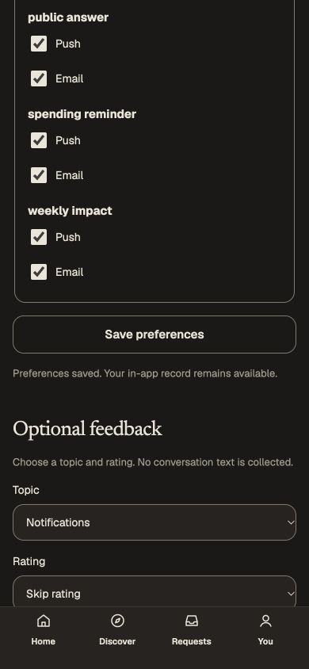

# Notification settings keep their original account — October 6, 2026

On the canonical isolated development host, opened actor three's settings, entered America/Anchorage, completed actual actor-two sign-in in another tab, then saved the old form. The database recorded that preference under actor two. This was a real cross-account intent adoption, not an injected successful response.

Home, Notifications and Settings now load their actual issued account/session before private server reads. Their mounted private views retain that tuple, conceal on negative session hints or resume, and restore only after a bounded canonical read confirms the original tuple. A four-second polling/read budget and five-second presentation lease conceal unavailable views; mounted input survives an outage. Negative hints never grant authority or permanently end a genuine replacement session. Concealment makes private content hidden/inert and moves keyboard focus to the recovery control when the hidden form owned it. Confirmed replacement or sign-out disposes the old view.

Preference saves, optional rating feedback, inbox read-before-open and Home engagement requests use the original tuple, with canonical reads before/after and a ten-second whole browser operation budget. The Growth proxy forwards both mismatch preconditions and preserves refusal codes; covered private endpoints refuse absent tuple headers. Actual backend credentials remain the authority. Public/future Growth actions and direct native contracts are unchanged. No CSS, catalogue, schema, provider, default environment or test code changed.

## Personally operated evidence

- Actual same-account second sign-in clears the old unsaved settings. Actual other-account sign-in clears Settings, Home and Notifications. Empty Home/inbox navigation was exercised; populated producer flows were not invented.
- On an actual guarded preference PUT, substituted only an earlier genuine same-account session ID. The backend returned 409, ended that old view and left the preference row's `xmin` unchanged. Refreshing the actual replacement session still worked. A different-account original tuple likewise returned 409 with both database rows unchanged. Removing both tuple headers returned the proxy's 400 and changed neither row. No identity, status or body was fabricated.
- Held a genuine successful preference response after commit. The browser operation deadline retained the local input and recovered its button; explicit unchanged retry succeeded. This qualifies state-setting recovery, not exactly-once revision semantics. Rating feedback remains append-only and does not gain lost-response idempotency here.
- Actual keyboard time-segment editing produced From 01:00 with Until absent. Submission showed the existing pair error and focused Until. Invalid timezone submission focused Time zone. A partial native time segment blocked native submission; fully clearing all segments restored a valid empty value. Programmatic time-field fills were excluded because they did not reliably update React state in this browser.
- Stopped only the review API while an unsaved Pacific/Honolulu draft was mounted. Private controls disappeared, with the draft still mounted but hidden. Restarted that same API/configuration/key; a canonical read restored the original input and focused its timezone control without saving. Initial outage focus was not separately accepted; the later sign-out run qualified recovery-button focus.
- Held genuine identity-session responses during actual sign-out in another tab. The original settings immediately showed only account checking and its recovery button, focused that button, and kept the old input hidden/inert. Actual paused responses were 401. Clearing interception allowed completed sign-out with no old controls. The earlier retained-private-form screenshot is explicitly marked `before-fix-…`, not evidence of successful concealment.
- On final source at 390 × 844/device scale 1, completed a genuine UTC preference save in Light and Night. Width and scroll width both equal 390; captures were saved after the real acknowledgement. Earlier on the guarded operation source, saved exactly one optional notification rating of 3. The database contains that single feedback row, no conversation text, and zero notifications, deliveries, devices, email addresses or public creator/content projections.

## Environment, checks and limits

Used the existing 61-migration isolated PostgreSQL database on 5546 and actual development issuer/canonical API on 4206 with web on 3106. Growth was explicitly configured only in private local environment files. Its dedicated non-owner/non-superuser/non-BYPASSRLS API login inherits only `creator_runtime` and `growth_runtime`, with no direct extra grants or ownership. The original core role remains NOINHERIT. The existing Growth worker is separate and NOINHERIT. Startup role checks passed. The generated encryption key is preserved privately with this disposable database; encrypted device/email rows were empty before first configuration. No producers, provider receipts or catalogue authorities were fabricated.

Final web types, scoped ESLint/Prettier and webpack production build passed. Build output uses a separate ignored directory; the generated Next environment import paths were restored. No unit tests were added or manually run. Saved [manifest, database receipts, logs and browser captures](../../artifacts/pr-review/2026-10-06/growth-notification-session/manifest.json). The earlier mismatch before/after/missing-tuple receipts are byte-identical; the later normal actor-three UTC save advances only that account's row.

This is a narrow session/recovery qualification. It does not accept the broad #31/#74 graphs, populated Growth, native, signing/media, providers, full accessibility, exact screen parity or a release. DI16's missing notification-control artboards remain open; no visual design was invented. The screenshot verifies actual form state/layout within existing components.

The browser account was genuinely signed out, overrides and interception cleared, and the review app/design tabs closed. Only the review API/web processes and review-only container were stopped. The database, private key and evidence remain preserved; no unrelated application resources were stopped or deleted.

