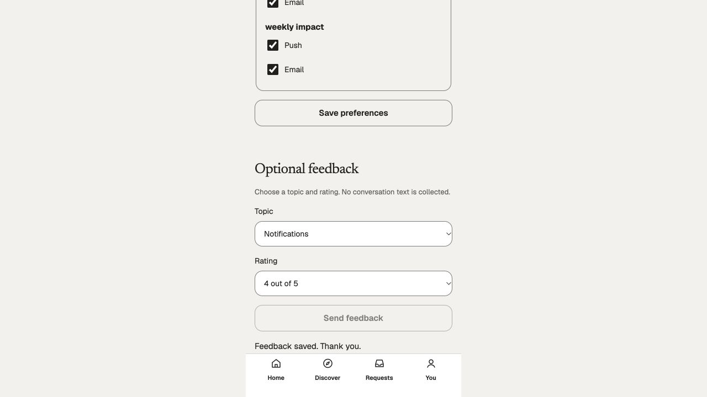

# Growth database budgets and connection settlement — October 6, 2026

The resumed review reproduced Growth extending a connection's 200ms statement timeout to 5s and its 100ms lock timeout to 2s. Transactions now preserve shorter positive PostgreSQL settings. Checkout requires the actual bounded, non-pipelined pool, and checkout exhaustion returns a retryable 503 with a private cause.

The transaction uses the existing `ContentHeldClient` only for connection settlement, without borrowing Content authority. Known SQL/domain failures retain their error and roll back. Unknown BEGIN/query/COMMIT responses and actual cancellation close and discard the original connection before returning, without speculative rollback SQL. Cancellation during queued checkout still awaits that bounded acquisition and closes the eventual client. BEGIN/COMMIT/ROLLBACK use the helper's bounded control queries, preserving shorter client read budgets.

## Personally operated evidence

The preserved review database is `creator_pr_review_full` in container `creator-pr-review-20261006`, port5546, with its canonical 61 migrations and existing non-owner Growth API/worker roles. No schema, grants, owner policy, reference, provider or native changes were needed.

- Before/after SQL receipts show the 200ms/100ms settings now survive inside the transaction and after return. An actual `pg_sleep(1)` is refused by PostgreSQL in 205ms.
- An inserted temporary row followed by a domain denial rolled back to zero rows and retained the original 409.
- An actual 40ms client read timeout closed its socket by 44ms, returned 503, and left zero clients in that one-client pool. Recovery used a different backend PID.
- Actual cancellation during SQL closed its socket and returned 503 in 34ms. Both old backend PIDs were absent at the later observation after the checkout exercises; socket close is not a claim of instantaneous server-side cancellation.
- Exhausting a real one-client pool returned 503 in 501ms with no queued acquisition left. Cancelling a queued acquisition, then releasing the occupied client after 80ms, discarded the acquired client before returning at 85ms. A following real transaction succeeded with no account context carried over.
- Through the actual canonical development sign-in and web notification settings, an exclusive lock on the feedback table produced 503 in 2025ms. The form kept rating four and its retry intent. After releasing the lock, the unchanged retry returned 201 in 25ms and persisted exactly one new row. Existing eight rows and their `xmin` values stayed unchanged. The actual success screenshot is included below.

Backend types, scoped ESLint/Prettier and backend production build passed. No test code or suites were added. [Raw observations, persistence and captures](../../artifacts/pr-review/2026-10-06/growth-transaction-settlement/).

## Deliberate boundary and remaining work

This does **not** introduce a whole-callback timer race. Growth callbacks include provider sends under erasure locks and nested transactions; abandoning a callback could release a fence while an external send or child operation remains active. The callback is still awaited. SQL budgets and source connection settlement do not qualify a finite provider operation, all-domain privacy completion or the broad #31 graph.

Further work requires a concrete provider cancellation/settlement contract before bounding sends; nested authority/erasure transactions need descendant settlement and commit-order qualification. In particular, `workerActor()` currently commits its inner runtime session transaction before its outer worker write commits. That independently identified ordering needs a focused fix and real session-revocation race operation. No provider success, caller cancellation capability or approved purpose is invented here. The frontend composition is unchanged; missing DI16 design and native operation remain separate holds.

