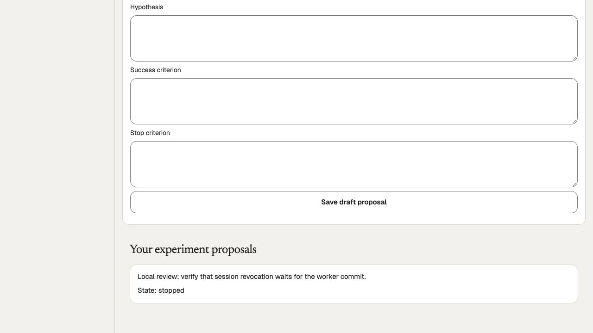

# Reuse Growth worker/session custody from PR31 — October 6, 2026

Before this increment, all 20 open draft heads were compared for the affected Growth files. Draft [PR31](https://github.com/WangPantopus/creator-platform/pull/31), head `c052ef67fa85301562b5123b682c88b931107c9a`, already contains `GrowthHeldClient` and `fencedWorkerActor()`. The relevant history is `ab4855ab`, `7d3c9eb3`, `b99460c3` and `c127dbe3`. This increment reuses those implementations instead of independently rebuilding the session-commit fix or importing PR31's unqualified broad graph. [Exact inventory and file variants](../../artifacts/pr-review/2026-10-06/growth-worker-custody/open-pr-overlap.json).

The prior #316 cleanup overlapped that draft's existing helper; its preservation of shorter SQL limits and bounded checkout/503 handling were new. This increment consolidates cleanup on PR31's Growth helper while retaining those new protections. The actual worker erasure fences are acquired before the runtime session, and the worker commits while that session remains held. An integration correction also settles a failed worker operation inside the runtime callback, before releasing its session; the copied branch's outer-only cleanup did not guarantee this on failure. `close()` now shares one cleanup promise, so early worker settlement and the outer finalizer cannot release the same client twice. A closed helper cannot be used again.

## Personally operated qualification

The canonical app ran on API4206/web3106 against the preserved isolated 61-migration PostgreSQL database. Only the Growth worker's loopback connection was routed through a disposable local protocol proxy on5547. It delayed actual outgoing `COMMIT` bytes after an actual proposal insert; it did not fabricate requests, SQL results, identity, provider receipts or acknowledgements. Read-only PostgreSQL observations recorded the real blockers. No proxy or test suite is added to the application.

Actual development actor three signed in through the issuer UI. Its existing synthetic creator received the same explicitly temporary administrator verification seed used in the previous local Studio review, solely to operate this local flow. This is not production identity verification or an approved experiment. Verification is restored pending, and the actual session is signed out.

- With a one-second worker COMMIT delay, an actual proposal save and actual Sign out overlapped. PostgreSQL showed logout PID190 waiting on the transaction lock held by original runtime PID191 at both 400ms and 800ms observations. After forwarding the real COMMIT, proposal creation returned 201 in1050ms, then sign-out returned200 after717ms. One draft persisted. An earlier pre-hydration attempt encountered browser required-field validation and sent no proposal; it is excluded.
- With the next COMMIT held beyond its1500ms control-read budget, actual sign-out PID244 waited on original runtime PID241. The client closed before the held COMMIT could be forwarded. Proposal creation returned503 in1552ms, sign-out completed after1217ms, and the full experiment receipt remained byte-identical, including `xmin`: the failed proposal was absent.
- After genuine sign-in/reload, the saved draft appeared. Clicking Stop this proposal persisted `stopped`, demonstrating recovery through a fresh worker connection. No experiment was activated. The review-only proxy is stopped and its port is released.
- With the reused helper, a real200ms/100ms PostgreSQL configuration remained intact; an actual40ms query read timeout closed/discarded by44ms; recovery used a different PID; actual cancellation also returned503 only after the socket ended. Pool count returned to zero in both discard cases.

Backend types, scoped ESLint/Prettier and backend production build passed. [Receipts, source hashes, logs and captures](../../artifacts/pr-review/2026-10-06/growth-worker-custody/). No schema, grants, provider, approved purpose, native, design or test-suite changes.

## Remaining boundaries

This verifies local database/session ordering through actual commit and timeout/cleanup. It does not claim instantaneous PostgreSQL server cancellation, provider physical settlement, a whole-callback deadline, genuine privacy-job completion or broad PR31 acceptance. Socket completion is distinct from the remote backend's final termination.

The actual Measurement page retained its private form/proposal after sign-out. PR31 already contains a session-bound page and actions; that existing implementation is the next candidate to isolate and qualify, reconciled with the already merged original-session helper. Do not rebuild it without comparing the draft. Subsequent work must first search the open/draft heads for the same feature or fix, then reuse qualified existing code with its source provenance.

