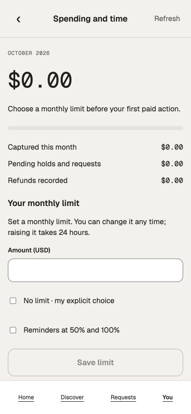

# Repository PR review — October 6, 2026

Assessed the 36 open/draft PRs and merged 16 into `main`. The remaining 20 stay draft. Verified final merged main `b825a454a81a6ca42c7de4ada4779e67810c061d`; its complete tree `569f6e1ce455a9af2de60c5f391f94718c7d9838` matches the locally built and operated integration source. No force pushes, branch deletions, hosted-check bypasses or held-purpose activation were used.

## Scope and evidence

Product/domain instructions, workstream status and handoffs, and the designed screens informed the review. All 36 PRs were inventoried by exact head, base, ancestry, changed production files, current hosted checks and their recorded evidence. Accepted production deltas received source review and combined compilation; held broad graphs received targeted source/evidence review, not a claimed exhaustive line audit. Earlier queued-CI statements in PR bodies are historical: the inspected head checks were successful for all 36 at review time.

The 11-PR W1 sequence was reviewed and integrated first, then five smaller lifecycle/transaction changes. Stacked accepted PRs were retargeted to `main` in dependency order and merged only at the reviewed head SHA, with completed successful checks. Every merged PR was reread from GitHub and confirmed `MERGED`, base `main`. Existing branches/history were preserved. Draft status alone was not a reason to hold a PR; unresolved affected behavior and missing meaningful runtime qualification were.

Local validation passed on the combined accepted source: all seven workspace type checks, canonical 12-resource/115-operation generation checks, ESLint, Prettier, backend build and Next webpack/TypeScript production build with 33 static pages. No unit tests were added or manually run. Existing hosted jobs include native and visual checks; this session did not personally launch a native app, perform production sign-in/passkeys, connect paid providers, record/sign media, or complete all-domain export/purge. Narrow source hardening merges do not imply those entire capabilities are release-ready.

## Personally operated flows

- Real isolated development identity: new handle onboarding shows no intro field; existing profile editing shows the optional intro. Actual backend outage preserves input; recovery saves it and reopening confirms the saved value.
- Keyboard authorship practice: four answers completed correctly, with Restart focused at 4/4. This checks keyboard behavior, not a participant comprehension study.
- Real Commerce Requests → You → Spending navigation using the canonical footer. At the designed 390×844 phone size, document width is 390 with no horizontal overflow.
- Unsaved 6.50 spending draft survives actual API shutdown; account status becomes unavailable and Save disables. Backend restart and Retry restore availability and the unchanged draft. No financial Save or provider request was submitted.
- Genuine second sign-in to the same account ends the prior view and clears its draft. Genuine other-account sign-in likewise removes the old private view; the new account's spending form is blank. No action or key is replayed.
- Actual PostgreSQL original Trust transaction: normal commit succeeds; a real division-by-zero SQL error rolls back; cancellation during `pg_sleep(10)` settles in about 101 ms and discards that socket; a new socket successfully serves the next transaction. This is a real database exercise, not a fake pool or unit test.
- Production web correctly refuses the plain-HTTP development identity redirect. Development identity operation used explicit development mode.

The fresh isolated database used the normal checksummed installer and 61 executable registered migrations. The runtime role is non-superuser, non-BYPASSRLS and NOINHERIT. Reserved purpose proposals stayed unapplied. Both development accounts retained zero spending-limit writes. Own API/web processes and the review-only Docker container were stopped after verification; its databases remain preserved. No existing Pantopus containers, databases or simulator devices were stopped or removed. Starting Docker restored its existing restart-policy containers; no other application data was modified.

Screenshot after actual other-account replacement, showing a blank new spending form:

## Merged PRs

| PR | Change and review basis | Merge commit |
| --- | --- | --- |
| [#21](https://github.com/WangPantopus/creator-platform/pull/21) | Onboarding handle/intro timing and original-session save lifetime; real sign-in, edit, outage and recovery operated. | `2224ae096ea8` |
| [#22](https://github.com/WangPantopus/creator-platform/pull/22) | Keyboard authorship practice completed 4/4 with Restart focused. | `c1a33cd8300b` |
| [#26](https://github.com/WangPantopus/creator-platform/pull/26) | Generators preserve unchanged output; canonical resource/API generation checks pass. | `57cc8cd94cf6` |
| [#28](https://github.com/WangPantopus/creator-platform/pull/28) | Team actions require current access reads and preserve stale/unknown states. | `42e49efac520` |
| [#29](https://github.com/WangPantopus/creator-platform/pull/29) | Canonical Home thread destination and native saved-thread navigation use original issued scope. | `af12c6886a7e` |
| [#35](https://github.com/WangPantopus/creator-platform/pull/35) | Signing retains original review/session and exact uncertain-publication custody. | `cfd4e1268651` |
| [#42](https://github.com/WangPantopus/creator-platform/pull/42) | Public Signed verification across clients uses public access and hides unavailable/withdrawn content. | `8c5f909927b0` |
| [#48](https://github.com/WangPantopus/creator-platform/pull/48) | Canonical native storage recovery copy; remaining delta is copy ordering. | `ecfbf68fcc09` |
| [#49](https://github.com/WangPantopus/creator-platform/pull/49) | Native origin/host handoff; remaining delta is documentation. | `94ea42263938` |
| [#51](https://github.com/WangPantopus/creator-platform/pull/51) | W1 source-preservation and successor handoff documentation. | `5f4756e4770c` |
| [#66](https://github.com/WangPantopus/creator-platform/pull/66) | Truthful outage states and phone viewport/focused-input sizing. | `40d628735b22` |
| [#201](https://github.com/WangPantopus/creator-platform/pull/201) | Private development artifact opt-in and original Trust transaction settlement; actual PostgreSQL success/failure/cancellation/recovery operated. | `d44da5658e73` |
| [#213](https://github.com/WangPantopus/creator-platform/pull/213) | Original Commerce Actor/context restoration and bounded original-client settlement; real Commerce reads operated. | `a24a81779241` |
| [#279](https://github.com/WangPantopus/creator-platform/pull/279) | Agent privacy/expiry role and original-client lifetime guards; preserves shorter deadlines and task-before-interrupt ordering. | `98bf741bfe2f` |
| [#289](https://github.com/WangPantopus/creator-platform/pull/289) | Recording signatures retain exact original asset, review/session and publication retry; compiled combined source, no positive passkey/media claim. | `b825a454a81a` |
| [#298](https://github.com/WangPantopus/creator-platform/pull/298) | Commerce forms bind original account/session; real API outage/recovery and same-/other-account replacement operated. | `862a9c8ff2b1` |

## PRs left open

These are holds for unresolved behavior or qualification, not assertions that every line is defective. Complete the named affected journeys on the accepted combined graph before reconsidering.

| PR | Reason and next qualification |
| --- | --- |
| [#31](https://github.com/WangPantopus/creator-platform/pull/31) | Broad Growth graph (170 production paths in original comparison). Populated Home/notification/share/retraction journeys and owner/provider inputs remain unqualified; iOS busy/large-text reading acceptance remains open. Needs an affected-journey run on the combined graph. |
| [#36](https://github.com/WangPantopus/creator-platform/pull/36) | Privacy snapshots/native session recovery overlap the W3 host graph. The recorded real export remains four domains complete/four blocked; completed download/purge and current native workflows are unverified. Needs genuine all-domain completion and native recovery verification. |
| [#63](https://github.com/WangPantopus/creator-platform/pull/63) | Large combined Conversation/Agent/Commerce host graph. No useful generated conversation or completed export/download/purge is demonstrated; original saved export is four complete/four blocked. Needs genuine producers and a complete user journey. |
| [#74](https://github.com/WangPantopus/creator-platform/pull/74) | Large integrated issuer/Support/Team graph. Recorded immediate populated-account concealment, Support access/session gating and feedback availability remain open findings. Needs those private-view issues resolved and actual affected app operation. |
| [#131](https://github.com/WangPantopus/creator-platform/pull/131) | Worker nonce/denial purpose 0093 remains reserved and unapplied. Source/catalogue observations are from an older synthetic cohort; current genuine worker/task/fault and denial/expiry operation are unqualified. Needs the accepted combined purpose catalogue and genuine worker verification. |
| [#132](https://github.com/WangPantopus/creator-platform/pull/132) | Large generation input/admission/retrieval/accounting graph. Accepted owner catalogue/policy, licensed inputs, original worker/task and provider/accounting completion remain absent. Needs real generation plus privacy/cancellation and final settlement operation. |
| [#145](https://github.com/WangPantopus/creator-platform/pull/145) | Terminal denial purpose 0100 and parent 131 remain held. Needs complete accepted catalogue and genuine worker terminal/settlement/race operation; zero-job SQL refusals do not establish successful settlement. |
| [#182](https://github.com/WangPantopus/creator-platform/pull/182) | Historical combined W3 review anchor, based on an immutable review branch rather than main. Do not merge into that anchor. Shares incomplete W3 export/host qualification; needs a current main-targeted review after prerequisites qualify. |
| [#192](https://github.com/WangPantopus/creator-platform/pull/192) | Finite development feedback/intro-offer policy and held 0207 purpose. Registered accepted policy/catalogue and actual save/skip/withdrawal/expiry/physical lifecycle are unqualified. Needs genuine lifecycle operation before enabling or accepting the wider change. |
| [#200](https://github.com/WangPantopus/creator-platform/pull/200) | Exact reply-review graph includes Commerce export callbacks from 301. Recorded first account-switch frame retains previous cases, and exact review purpose 0069 is held. Needs immediate private-view concealment, current review/sign/send operation and bounded artifact settlement. |
| [#242](https://github.com/WangPantopus/creator-platform/pull/242) | Original privacy task/family authority uses held 0209/0214 purposes and a separately qualified provenance profile. Accepted executable graph/catalogue and original all-family export/purge completion are missing. Needs genuine original-task family verification. |
| [#247](https://github.com/WangPantopus/creator-platform/pull/247) | Safety/allowance terminal graph lacks accepted catalogue pins and genuine provider/output/financial settlement. Recorded original 0157 trigger has three unsuppressed 42703 static field diagnostics. Needs those diagnostics resolved or conclusively qualified and real terminal settlement. |
| [#262](https://github.com/WangPantopus/creator-platform/pull/262) | Original publication worker graph has no complete accepted catalogue, approved minimum or configured genuine issuer/factory. Whole deadline for external callbacks and real sign/System/delivery/financial/final-COMMIT operation remain unqualified. |
| [#282](https://github.com/WangPantopus/creator-platform/pull/282) | Call offer/session changes have negative/recovery observations only. Positive scheduling/DST/concurrent/expired-slot handling, exact retry and provider/outcome/settlement journeys are unverified. Needs an actual configured call lifecycle. |
| [#284](https://github.com/WangPantopus/creator-platform/pull/284) | Recorder preparation/cleanup improves ownership, but final delegate-adoption race correction is compile-only. Successful actual recording, adoption, playback and encode-error cleanup remain unverified. Needs current signed native recorder operation. |
| [#288](https://github.com/WangPantopus/creator-platform/pull/288) | Unique Team editor changes depend on the unaccepted 74 graph; against main this pulls over 1,100 paths. Needs 74 qualified or the narrow Team delta isolated on current main, then current role-withdrawal/uncertain-retry and native acceptance. |
| [#301](https://github.com/WangPantopus/creator-platform/pull/301) | Concrete unbounded sink issue: begin/assertCurrent/write/complete/abort callbacks are directly awaited without an enforceable sink deadline. Source socket budgets cannot bound them. Needs a protected writer with physical cancellation/settlement and a genuine export task through EOF/ACK/COMMIT. |
| [#302](https://github.com/WangPantopus/creator-platform/pull/302) | Content group-publication consumer depends on held 262 and unaccepted owner catalogues/approved minimum. Needs the genuine configured group worker, signing/media/System/delivery and once-only final commit plus fan retraction verification. |
| [#303](https://github.com/WangPantopus/creator-platform/pull/303) | Native original-session Commerce changes compile, but current iOS/Android outage recovery, session replacement, disposal/configuration restoration and store result lifetimes lack complete operated acceptance. Recorded Android Night/closure failures remain. Needs current native app verification. |
| [#305](https://github.com/WangPantopus/creator-platform/pull/305) | Studio media/session and worker publication graph lacks the accepted expanded catalogue pin. Prior photo lost-ACK/retry operation does not qualify late host-detach save or positive microphone/signature/publication/playback. Needs those actual affected flows. |

## Final verification and limits

The final remote main tree exactly matches the locally validated accepted integration tree. GitHub confirms all 16 merge commits; all other original PRs remain draft. The fresh post-merge Foundation run is pending at this record's closure: [main run](https://github.com/WangPantopus/creator-platform/actions/runs/37530303126). Its pending status is not a pass. Intermediate main runs were cancelled by the workflow's concurrency policy as later merges arrived; reviewed PR-head checks had completed successfully before each merge.

Machine-readable exact heads, dispositions and merge receipts are in [review.json](../../artifacts/pr-review/2026-10-06/review.json), with [checked-head results](../../artifacts/pr-review/2026-10-06/reviewed-head-checks.json), [verified merge receipts](../../artifacts/pr-review/2026-10-06/verified-merges.json) and whitespace-normalized compilation/generation/lint/format logs beside them. The saved screenshot contains only synthetic local app data. Temporary browser error tabs could not be closed through the browser URL policy; active review tabs were closed and the viewport reset.
