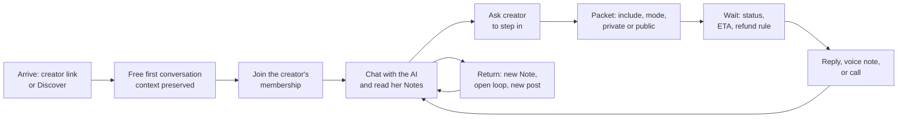
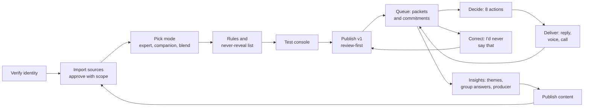

# Product Design: Flows, Screens and Copy

Sep 22, 2026 · @YP

Two apps on one identity system: a fan app (web plus a thin native shell) and a creator studio (web). Every screen here is a view over objects in the [Domain Model and Behavioral Contract](https://claude.ai/artifact/4sbrpzpHMQcjD572JxHGFu), and each names the objects and invariants it depends on. Visual design comes after this document; nothing here fixes a color or a typeface beyond what the identity system requires.

## 1. Design principles

Seven rules. When two screens disagree, the earlier rule wins.

1. **Who is speaking is always answerable in under a second.** Every message, avatar, call screen, notification and receipt carries an authorship state in text and in a visual token. There is no ambiguous state and no "sort of the creator" (INV-01, INV-06).
2. **The AI must be worth talking to on its own.** A fan who never pays for a human moment still gets a useful, cited, remembering conversation. If the AI exists only to sell the human, fans leave and creators are blamed (D-B).
3. **Access is explained by what you can do now, never by a slogan.** Every place access matters answers four questions in the fan's situation: what can I do now, what is included, what needs a request, when does it change. The pass-is-reach, tier-is-depth rule stays in the model (INV-07); it is not fan copy.
4. **The handoff is the product.** Asking for the person is a deliberate act with a packet, a mode, a price, a deadline and a refund rule on one screen. It is never a side effect of chatting, never a meter, and never a guilt trip (INV-13, INV-16, INV-17).
5. **Keep the relationship warm between human moments, without pretending.** The AI remembers, follows up on open loops, and tells the fan when the creator posted about what they asked. It never says the creator remembers, read, or felt anything (INV-05).
6. **This is the honest version of an industry that already exists.** Paid creator chat is today run by outsourced "chatters" whom fans believe are the creator. Here the label is the product: there is no setting, plan, or team role that hides it, and an approved draft is always shown as one. A creator who wants the label hidden is not a customer.

7) **Presence is cheaper than replies, and fans value it more.** The product is a ladder of presence: Notes and reactions cost the creator minutes and seconds and form the daily habit; public answers, private replies, voice notes and calls are the premium rungs. Every rung is human, signed, and labeled; the AI keeps the relationship warm between rungs and never sells them (INV-21, INV-22).

An eighth rule governs the creator side: **setup in ten minutes, control forever.** The studio shows value (the first handled conversation) before it asks for governance, and every guardrail is one screen away at all times.

## 2. Identity system

Seven authorship states, each with a fixed word, a fixed visual token, and a fixed audio treatment. The token is rendered into the message content, not the surrounding chrome, so it survives screenshots, search results, exports and notification previews. The color pair from the concept screens (violet for AI, amber for the person) is kept as the working default; the visual pass may change the hues but not the rule that they differ and that color is never the only signal.

| State | Label text (fan-facing) | Visual token | Voice / audio | Where it appears |
| --- | --- | --- | --- | --- |
| ai | "Maya's AI" | AI color bubble, AI glyph beside the name | Voice note opens with a one-second spoken tag: "Maya's AI" | Thread, notifications, search, receipts |
| approved\_draft | "Prepared by AI · approved by Maya" with her initial | Split bubble: AI color on the left edge, person color on the right; her initial at the end | Not offered as voice | Thread, receipts, request status |
| human\_creator | "Maya" | Person color bubble, verified glyph | Real recorded voice; the note opens with the recorded person, no tag needed, the label is visual | Thread, notifications, receipts |
| human\_call | "Maya · the person" chip pinned for the whole call | Person color chip on the call screen; "Not recording" state shown beside it | Live | Call screens, post-call summary |
| team | "Maya's team · Priya" (role label, first name) | Neutral color, team glyph; never the creator's avatar | Not offered as voice | Thread, notifications |
| fan | The fan's handle | Right-aligned, neutral | Fan voice notes allowed | Thread |
| system | No author; italic status line | Centered, muted | None | Thread (takeover, handback, answered publicly, slot ended, paused) |

Added in the second review:

| State | Label text (fan-facing) | Visual token | Voice / audio | Where it appears |
| --- | --- | --- | --- | --- |
| human\_broadcast (a Note) | "Maya · to Studio members" (the audience is always named, even when the Note greets the fan by handle) | Person color with a broadcast glyph; never the private-reply bubble | Maya's recorded voice, up to 60 seconds | Thread, notifications, Home |
| human\_reaction | "Maya reacted to your reply" | The reaction on the fan's message, with Maya's avatar | None | Thread, Replies, notifications |
| Signed marker | A small "Signed by Maya" check on every human act under her name; tapping it opens the verification page | Check glyph in the person color | None | Every human\_creator, approved\_draft, human\_broadcast and human\_reaction |
| Correction | "Maya's note on this AI reply" pinned under the AI message | Person color, attached to the AI bubble | None | Thread, verification page |
| fan\_agent (reserved, disabled) | "{handle}'s assistant" | Neutral, assistant glyph | None | Not shown until enabled |

### Rules the identity system enforces

- The identity strip at the top of a thread never scrolls away. It names who will read what the fan types next: "You're talking to Maya's AI", "Maya is here", or "Maya's team is here".
- A notification's sender label is the authorship state of the message it previews. A push that says "Maya replied" exists only for human\_creator and human\_call.
- The primary button in a thread is always the AI. The only person-colored button is "Ask Maya to step in", and it opens the packet, never a payment sheet.
- A handback is a system line ("Maya left the conversation · you're back with Maya's AI"), and the next bubble is AI colored. No transition is silent.
- Screen readers get the state as text before the message body ("Maya's AI says: ..."). Color-blind rendering keeps the glyph and the word.
- The official badge on a profile means authorization. The profile says what it does not mean, once: "Official means Maya authorized this AI. It does not mean she read your message."

### What the AI may and may not say about itself

| May say | Never says |
| --- | --- |
| "I'm Maya's AI" · "I remember you asked about X" · "This is one Maya would want to see herself" · "Maya's 2024 post covers this" (with citation) | "I'm Maya" · "Maya remembers you" · "Maya read this" · "Maya will reply soon" · "I miss you" · "Keep chatting and she'll notice" |

The never column is the output classifier's spec (INV-05, INV-17, INV-20); the may column is the copy writer's.

## 3. Information architecture

The fan app is organized around relationships, not around the pass: the home tab is the fan's conversations, and the pass is a billing object one tab over. The creator studio is organized around the queue, because that is where the creator's time and money meet.

```mermaid
flowchart TD
  FA[Fan app] --> H[Home: conversations, requests, calls, new posts]
  FA --> D[Discover: by need, by category, by name]
  FA --> R[Requests: status, receipts, calls]
  FA --> Y[You: pass, intro card, privacy, memory, consents]
  CS[Creator studio] --> Q[Requests: commitments first, then packets]
  CS --> TH[Threads: audit, pause, take over, correct]
  CS --> AI[My AI: mode, sources, style, rules, test, publish]
  CS --> OF[Offers: tiers, human modes, capacity, availability]
  CS --> PU[Publish: posts, media, live, AI-use toggle]
  CS --> IN[Insights: themes, group answers, producer]
  CS --> EA[Earnings and team]
```

Read as two trees: five fan tabs on the left, seven studio sections on the right.

### Fan app (five tabs)

| Tab | Holds | Objects | Why it is a tab |
| --- | --- | --- | --- |
| Home | Open requests and upcoming calls pinned above; then threads sorted by activity; then a chronological, permission-aware "New from people you follow" list of posts (no ranking, no algorithmic feed); near the 1st, a next-month draft reminder | Thread, Packet, Session, Content, PassSlot | The relationships and the creator's work are what the fan comes back for |
| Discover | Search by need ("who can help me with cone 6 glazes"), categories, creator cards with reliability stats, "member", "try a free conversation", and "join" (pass markers appear only once the pass launches, D-23) | CreatorProfile, Grant (trial), PassSlot | Finding a creator by what they can answer is the pass's reason to exist; the pass is bought from here as often as from You |
| Requests | Every Packet with live status, ETA, countdown, receipt, withdraw; every Session with join button | Packet, Commitment, Session, LedgerEntry | Waiting for a person is tolerable when the queue is visible |
| You | Pass, once it launches (slots, allowance, next-month draft, replacement flow; D-23), handle and intro card, per-creator memory and conversation access history, consents, notification controls, export, delete | PassSubscription, PassSlot, FanProfile, Memory, consents | Billing and privacy are one place the fan goes on purpose. Moving the pass here is a hypothesis to test with fans managing monthly selections (review 2.3); if it fails, the pass returns as a fifth tab |

### A creator's home

Every creator has one coherent home with four segments: **Chat** (the thread), **Posts** (their content, permission-aware, with "Ask Maya's AI about this" on eligible items), **Requests** (this fan's packets and calls with this creator), and **Access** (what the fan can do now with this creator, what is included, what needs a request, and when it changes). It is also the public web page a creator links to from their bio, so the segments render for a signed-out visitor with sign-in preserving where they were (section 4).

### Creator studio (seven sections)

| Section | Holds | Objects | Why it is a section |
| --- | --- | --- | --- |
| Requests | Commitments due (dedicated view with deadlines), then packets by SLA, then creator-rule matches; capacity header | Commitment, Packet, Capacity | Obligations first, opportunities second (INBOX-01) |
| Threads | Every thread of the agent: read (logged), pause for this fan, take over, mark "I'd never say that" | Thread, Message, Memory, audit log | D-01 makes this a right; the log makes it accountable |
| My AI | Mode, sources with counts and audience scope, style card and examples, rules and never-reveal list, handoff triggers, approval policy, test console, versions and rollback | AgentVersion, KnowledgeSource, StyleExample | The agent is a governed thing with a history, not a prompt box |
| Offers | Tiers, human modes with price, deadline, refund rule, weekly capacity, eligibility; availability windows for calls | Tier, HumanMode, Capacity | Pricing lives with the creator and nowhere else |
| Publish | Drafts, audience rule, AI-use toggle (separate), preview as a member, schedule, live events | Content | "Who can see it" and "may the AI use it" are two controls |
| Insights | Weekly themes (min-group), unresolved clusters with group-answer button, producer recommendations, what the AI could not answer | Insight | The AI's questions become the creator's next content |
| Earnings and team | Pool share with the slot count that produced it, tier revenue, human modes, tips, payouts; team roles | LedgerEntry, TeamMembership | Money explained by cause; delegation made explicit (D-07) |

Added in the second review: **Notes** joins the studio as its own section (compose, schedule, audience, and the Replies feed with reactions and quote-replies; S-C12), and **License and sponsorships** joins Earnings and team (S-C13). On a phone, Notes is the first tab, because posting a Note is the thing a creator will do most often.

### Cross-cutting surfaces

The thread (fan side) and the packet detail (creator side) are the two screens where every other surface meets; they get the most design attention. Checkout is a web surface reached from any purchase point; the native shell opens it in a sheet (section 11).

## 4. Fan journey

Two entrances, one path, three loops. Nearly all first visits will arrive through a creator's own link, so the creator-led entrance is the primary one and the discovery-led entrance is secondary. The first loop is discovery to a useful AI answer, which must complete with no payment at all. The second is the handoff. The third is the return, which is where the pass earns its renewal.

### Entrances

| Entrance | The fan arrives from | What the first screen is | What sign-in preserves |
| --- | --- | --- | --- |
| Creator-led (primary) | A link in the creator's bio, a post link, a livestream invite, a shared acknowledgment card | That creator's public home, already showing what her AI can talk about, her modes, reliability, and the specific post or invitation if the link named one | The creator, the post or invitation, and the draft message if the fan typed before signing in; after sign-in the fan lands in that creator's Chat with the context card in place, never in generic onboarding or Discover |
| Discovery-led | The app or site with no creator in mind | Discover with three example needs and categories | The search and the card the fan tapped |

A post link opens the thread with that post as a visible context card the fan can remove; a livestream invite opens the event; a profile link opens Chat. Three different arrivals, three different first messages, never the same empty composer.

Added in the second review, a third entrance: **Instagram comment.** A creator's post says "comment KILN"; one automated private reply (Meta allows one per comment) carries a link to her home with that post as the context card. The conversation continues in our app, never inside Meta's DMs, where automated messaging is limited to a 24-hour window and general AI assistants are restricted.

Each node is a screen in section 5. The loop C to B to C is the retention mechanism and is driven by memory and notifications, not by nudges to spend.

| Step | Screen | Domain flow | What must be true to move on |
| --- | --- | --- | --- |
| Arrive | Creator home (public) or S-F3 Discover | F2 | The creator's page shows what her AI knows, reliability stats and "try 5" before any price; a post or invite link carries its context |
| Sign in | S-F1 Onboarding | F2 | Pantopus sign-in; handle chosen; the AI-thread notice acknowledged; the fan returns to exactly where they were |
| Try | S-F5 Thread (trial state) | F3 | A free first conversation of about 24 hours (D-26), full identity system, memory on; when it ends, at the next natural pause, the composer explains the membership in the fan's situation |
| Add | S-F4 Access segment (join the membership); S-F10 once the pass launches | F2, F10 | Confirmation shows what the fan can do now, what is included, what needs a request, when it changes |
| Chat | S-F5 Thread | F3, F4 | Citations open the exact passage the fan is allowed to see; memory card reachable; reminder every three hours of continuous use |
| Ask | S-F5 button | F5 | Capacity above zero; otherwise the button explains when it returns |
| Packet | S-F7 Packet | F5 | Fan edited or accepted the summary; chose mode; saw "charged only if accepted" and the access notice |
| Wait | S-F8 Request status | F5, F6 | ETA from reliability stats; withdraw available until accepted |
| Reply or call | S-F5 Thread, S-F9 Call | F7, F8 | Delivery labeled; the human answer becomes memory; share card offered if allowed (D-15) |
| Return | S-F2 Home, S-F5 Thread | F4, F14 | Open loop follow-up on first AI turn; "posted about what you asked" notification; new posts on Home |

### Time-to-value targets

First useful AI answer within two minutes of first open, with no account beyond the Pantopus sign-in and no payment. First packet no earlier than the fan wants it and never prompted by the AI. These are design constraints, not metrics; the metrics document sets the numbers after pilot.

## 5. Fan screens

Sixteen screens. Each lists what it is for, the objects it reads and writes, its one primary action, its states, and the copy that must appear. "States" always includes empty, loading, and the honest states from section 8 that apply.

### S-F1 Onboarding

|  |  |
| --- | --- |
| Purpose | Get from wherever the fan arrived to a first AI conversation in under two minutes, without losing where they arrived |
| Objects | Account (shared), FanProfile |
| Primary action | Continue with Pantopus, then "Back to Maya" (creator-led) or "Find someone to talk to" (discovery-led) |
| Steps | Sign in with Pantopus identity (18+ enforced by the account, D-11) → pick a public handle (pseudonym allowed; the app explains that the handle is what creators see) → one-time notice: "Conversations with a creator's AI can be read by that creator and their authorized team. Those accesses are logged. You can delete any conversation at any time." → return to the preserved context. The intro card ("Tell creators' AIs about yourself once") is offered later, from the thread, after the first useful answer, not here |
| States | Handle taken; Pantopus sign-in failed (retry, no local account creation); under-18 account (declined with the age policy, no partial access); notice must be acknowledged before the first thread opens |
| Copy | The notice sentence above is fixed text (D-01) and reappears in You and on each new thread's first open |

### S-F2 Home

|  |  |
| --- | --- |
| Purpose | The fan's relationships and the creators' new work in one place |
| Objects | Thread, Packet, Session, Content, PassSlot, Memory (open loops for preview lines) |
| Primary action | Open a thread or a post |
| Layout | Pinned row: open requests with status chips and upcoming calls with join buttons. Then threads sorted by last activity, each with the creator's avatar, the last message's authorship glyph, and a one-line preview. Then "New from people you follow": posts in reverse chronological order, permission-aware (locked posts show the tier that unlocks them), each with "Ask about this" when eligible. Near the 1st: a card "Next month's pass: Devon → Priya, applies Oct 1". |
| States | Empty ("Pick a creator to start" with a Discover button); slot ended threads shown with a muted "readable" tag; paused agent shown with the reason; no followed creators have posted (section hidden, not empty) |
| Copy | Preview lines never claim the creator wrote something the AI wrote; the glyph decides. The posts list is chronological and says so; there is no ranking to explain |

### S-F3 Discover

|  |  |
| --- | --- |
| Purpose | Find a creator by what the fan needs, then judge fit before spending a slot |
| Objects | CreatorProfile (reliability stats, mode, content class), Grant (trial), PassSlot |
| Primary action | Search by need; tap a card |
| Layout | Search field with placeholder "What do you want help with?"; results are creators whose approved sources match, with a one-line "Maya's AI can talk about: cone 6 glazes, kiln repair, studio setup". Categories below. Each card shows: official badge, mode label ("Expert AI" or "Companion AI"), "Answers requests within 48 h · 6 of 20 left this week", and one of "Member", "Try a free conversation", or "Join" (and "In your pass" once the pass launches, D-23). |
| States | No results (offer to browse categories; never invent a creator); creator paused (card shows return date; no try button) |
| Copy | Reliability stats are the same numbers as on the profile and in the packet (INV-10) |

### S-F4 Creator profile

|  |  |
| --- | --- |
| Purpose | The creator's home and public front door: show what her AI knows, what she offers, and how reliable she is, then route to the AI first |
| Objects | CreatorProfile, AgentVersion (source summary), Tier, HumanMode, Capacity, Content, Grant |
| Primary action | "Message Maya's AI" (AI colored) |
| Layout | Name and official badge → **What Maya's AI knows**: a source summary ("312 posts, 48 FAQ answers, this week's update") and "can talk about: cone 6 glazes, kiln repair, studio setup" → honest presence line from human events only ("Answered 6 requests this week · last personal reply yesterday") → capacity and response time → the four segments Chat, Posts, Requests, Access → in Access: the ladder (Follow free · tiers · human modes each with price, deadline or duration, refund rule) and the four access lines for this fan (what you can do now, what is included, what needs a request, when it changes) → the official-badge disclaimer |
| Public (signed-out) state | Everything above renders; Chat shows the first AI turn as a preview and asks for sign-in on send; the URL is the creator's link-in-bio |
| States | Capacity zero (human modes collapse to "Maya is fully booked this week · opens Monday"); paused; no tiers (ladder shows free plus modes); fan already in a tier (Access lines say "Maya's AI is included with your Studio membership · no pass slot needed") |
| Copy | Human modes read "Written reply from Maya · 48 h or refunded · $X"; never "from $", never a per-minute rate. Presence lines derive from human\_creator and human\_call events only, never from AI activity |

### S-F5 Thread

|  |  |
| --- | --- |
| Purpose | The conversation; where the two presences meet |
| Objects | Thread (control, epoch), Message, Memory, KnowledgeSource (citations), Content (context card), Grant, Capacity |
| Primary action | Send to the AI |
| Layout | Identity strip pinned at top ("You're talking to Maya's AI · Maya steps in on request"); bubbles per section 2; a **context card** at the top of the composer when the fan arrived from a post or tapped "Ask about this" (title, thumbnail, remove); each AI bubble may carry a **citation chip** that opens the exact passage (timestamp in a video, paragraph in a post); a memory chip after any turn that wrote memory ("Remembered: you fire at cone 6", tap to edit or "don't remember this"); composer with one person-colored button "Ask Maya to step in"; after the first useful answer, a one-time offer to write an intro card |
| Citations | A new answer can only cite a source the fan can currently open (INV-08); the chip always opens. A historical message may carry a citation to a source the fan has since lost access to; that chip reads "No longer accessible to you" and the source is never used in a new answer |
| First turn on return | If an open loop exists, the AI's first message may ask about it. The fan can dismiss with "Don't follow up on this", which deletes the open loop |
| Reminders | After three hours of continuous use the AI's next message is preceded by a system line: "You've been talking with Maya's AI for a while. It's an AI, and it will be here when you're back." (D-11) |
| Message states | local\_pending (greyed, retry on failure) → accepted (server acknowledged, typing indicator) → generating (streaming) → delivered; failed shows a retry; interrupted keeps the delivered text with an "interrupted" tag when the creator took over mid-reply |
| States | Trial (composer shows "Free conversation · 18 h left"; when time runs out it ends at the next natural pause, never mid-disclosure); slot ended (readable, composer explains in the fan's situation); allowance exhausted; agent paused ("Maya's AI is paused · requests still work"); human\_active (strip turns person colored: "Maya is here"; AI composer hint gone); blocked; capacity zero (step-in button explains when it returns) |
| Copy | Every AI message is labeled; the AI may say "This is one Maya would want to look at herself" and never "Maya will reply" |

### S-F6 Memory card

|  |  |
| --- | --- |
| Purpose | Turn a privacy obligation into a feature: what this AI remembers about you |
| Objects | Memory (facts, summary, open loops) |
| Primary action | Edit or delete an item |
| Layout | Grouped: "About you" (facts), "Open threads" (open loops), "Summary so far"; each item with provenance ("from your message on Sep 14") and delete; a switch "Remember new things" per creator; the D-01 notice line |
| States | Empty ("Nothing remembered yet"); memory off |
| Copy | "Maya's AI remembers this. Maya does not see it unless you share it in a request or she reads the conversation, which is logged." |

### S-F7 Packet

|  |  |
| --- | --- |
| Purpose | Consent to what goes in the request, mode, price and promise on one screen |
| Objects | Packet (draft), HumanMode, Capacity, LedgerEntry (hold) |
| Primary action | "Send request · $X if accepted" (person colored) |
| Layout | **Included in your request**, with checkboxes: AI summary (on, editable inline), last N messages and attachments (on), whole conversation (off), your name and city (off; otherwise handle). Under it, the access notice: "Maya and her authorized team can separately review this AI conversation. Those accesses are logged." Then "How": the creator's modes as rows with price, deadline or duration, and refund rule; one selected. Then "Who sees the answer": Private (only you) or Public (Maya's members can read it, it may help her AI answer others, and it costs less); the AI first shows any public answer that already covers the question. Then the rule line: "Charged only when Maya accepts. If she declines or 48 h pass, nothing is charged. Maya may answer with her AI's draft; you'll see that label." Then the ETA line from reliability stats and capacity |
| States | Capacity full for the chosen mode (row disabled with return time); hold fails (packet stays draft, nothing sent, retry payment); card needs authentication (the bank's step, then back here); summary edited (shows "edited by you") |
| Copy | The heading is "Included in your request", never "What Maya will see": the packet decides what is sent for her attention, not what she is able to read (D-01). Never a meter, never a running total, never "Maya is waiting" |

### S-F8 Request status and receipt

|  |  |
| --- | --- |
| Purpose | Make waiting for a person tolerable and every outcome legible |
| Objects | Packet, Commitment, Session, LedgerEntry, ShareGrant |
| Primary action | Withdraw (until accepted) or Join (for a scheduled call); after delivery, Share (if allowed) |
| Layout | Status stepper: Sent → Seen by Maya's queue → Accepted → Delivered, with the current step's timestamp; ETA ("Maya usually decides within 31 h · 4 requests ahead of you"); after acceptance, the deadline countdown and the refund rule; receipt with mode, price, hold or capture state. After a delivered written reply or voice note, if the creator allows sharing for that mode: "Share this reply" makes a card ("Maya replied to @kilnfire") with the fan's choice of handle display; the card carries the authorship label and can be revoked by either side (D-15) |
| States | Declined ("Maya passed on this one · nothing charged" plus a one-tap reason if she chose one: "outside what I do", "fully booked", "my AI already covered this"); expired; withdrawn; more info requested (inline reply box); deadline missed ("Refunded automatically"); converted-to-group offer (accept at group price or keep waiting); call outcomes per D-16: completed, partial ("Maya had to end early · refunded for the minutes you didn't get"), creator no-show (refund and rebook), fan no-show ("You missed the call · charged as agreed"), technical failure (rebook or refund) |
| Copy | "Seen by Maya's queue" is a system event, never "Maya read your message" (CHAT-06). A decline reason is never personal |

### S-F9 Call

|  |  |
| --- | --- |
| Purpose | Deliver the scarce thing with the same identity rules and three honest clocks |
| Objects | Session, Commitment, Message (human\_call) |
| Primary action | Join; then End |
| Layout | Pre-call: appointment time, duration, what Maya saw (the packet), recording state, "no overtime charge", the reconnection allowance in plain words ("If either of you drops, the timer pauses for up to 3 minutes total"). Waiting room shows who has joined and the grace countdown; joining early starts nothing. Connected: person-colored chip "Maya · the person", the connected-time timer counting to the fixed end, "Not recording" state, mute, camera, leave, report. Post-call: outcome in one line, then "Both of you can get a short summary" with a consent switch each, "Either of you can delete it" |
| States | Waiting (grace countdown); reconnecting (same session, timer paused, allowance draining); creator no-show (refund notice, rebook); fan late past grace (charged, explained before booking); creator ended early (partial: pro-rated refund shown); recording requested by one side (the other must accept; default off) |
| Copy | "Ends at 10:00 · no overtime charge · extending is a new booking"; outcomes use the D-16 words, never "delivered" for a no-show |

### S-F10 Pass (inside You; arrives once the roster is large enough, D-23)

|  |  |
| --- | --- |
| Purpose | Slots, allowance and next month, explained in the fan's situation |
| Objects | PassSubscription, PassSlot, Grant |
| Primary action | Choose a slot or edit next month |
| Layout | Three slots (people, not features); allowance meter ("Messages to AIs this month 42 / 300", the only meter in the app); per slot, the access lines for that creator ("Maya's AI · in your pass · personal replies requested separately"; or "Included with your Studio membership · no slot needed"); "Next month's draft" with the swap and the apply date; manage subscription (web checkout on web; in-app purchase management in the native app, D-14) |
| States | No pass (explains the pass and shows trial counts instead); replacement offered ("Devon's AI is unavailable · pick a replacement for the rest of this month, free"); incomplete draft near the 1st ("Your current three carry over"); iOS-purchased pass (price and management shown as the store's) |
| Copy | No slogan. Each line states a capability, an inclusion, a request, or a date |

### S-F11 Notifications

See section 9. The screen is a list with the sender label per row and a per-creator mute.

### S-F12 Me and privacy

|  |  |
| --- | --- |
| Purpose | Identity, memory, access history, consents, notification controls, export, delete |
| Objects | FanProfile, Memory (per creator), consents, thread\_audit, notification preferences |
| Primary action | Edit intro card |
| Layout | Handle and intro card with per-creator share toggles; per-creator memory cards; consents list (recording, summary, reuse in content, sharing a reply, training, each per creator and per event); **Conversation access history** (per thread: which authorized account opened it and when; the wording says an account opened the conversation, not that a person read every message); notification controls (push and email separately, per creator, quiet hours, sensitive-preview off); export; delete conversation (with the D-08 retention exception stated on the confirmation); delete account |
| States | Access history empty ("No one has opened this conversation") |

### S-F13 Post and content view

|  |  |
| --- | --- |
| Purpose | Consume content and jump into the thread with it as context |
| Objects | Content, Grant, Thread |
| Primary action | "Ask Maya's AI about this" when the item is approved for AI use and the fan has access |
| States | Locked (shows what tier unlocks it; the AI button hidden, not just disabled, so the AI is never asked to summarize a locked item) |
| Copy | Locked previews are creator-controlled and never leak restricted text |

### S-F14 A Note in the thread (added in the second review)

|  |  |
| --- | --- |
| Purpose | The creator's real presence in the fan's own thread, several times a week |
| Objects | Broadcast, BroadcastReply, Reaction, Thread |
| Primary action | Reply to the Note |
| Layout | The Note appears in the thread in the person color with the broadcast glyph and its audience label ("Maya · to Studio members · Tue 9:14"), the Signed marker, and any photo or voice. A reply box under it says "Reply to Maya's Note · only Maya and her team see replies". After a reply, the thread shows the reply with "Sent to Maya's Notes" and, if she reacts, "Maya reacted". The AI can discuss the Note afterward ("Want to know more about the new kiln she mentioned?") and never says she read the fan's reply |
| States | Note retracted ("Maya removed this Note"); fan not in the Note's audience (not shown); quote-reply (a second Note quoting one reply, without the handle unless that fan agreed) |
| Copy | Replies are described as going to Maya's Notes, never as "Maya will see this" |

### S-F15 Spending and time (inside You, added in the second review)

|  |  |
| --- | --- |
| Purpose | Let fans set their own limits before money moves, and see their own use honestly |
| Objects | SpendLimit, LedgerEntry, usage |
| Primary action | Set or change the monthly limit |
| Layout | At the first paid action, a short step before checkout: "Set a monthly limit for requests and memberships" with suggested amounts and an explicit "No limit" choice. In You: this month's spend by creator, the limit, reminders at 50% and 100% (on by default), "Raising your limit takes effect in 24 hours; lowering it is immediate." A weekly usage view (time with each creator's AI). In companion mode, after 90 minutes in a day, a gentle system line in the thread |
| States | At limit (requests show "This would pass your monthly limit"; nothing is held); pending increase (shows when it takes effect); refund within 7 days of an unused membership ("Full refund, since you haven't used it") |
| Copy | Never shows other fans' spending; never ranks fans by money |

### S-F16 Verification page (added in the second review)

|  |  |
| --- | --- |
| Purpose | Let anyone who sees a shared card or screenshot check who wrote it |
| Objects | Message, SignedAct, Provenance, Correction |
| Primary action | None; it is a public page at a stable URL printed on every share card |
| Layout | The message as shared, its authorship ("Written by Maya's AI" or "Signed by Maya" with the signing time), for AI messages the sources it cited that are public, and any correction Maya attached ("My AI got this wrong: the cone number is 6, not 10"). Nothing about the fan beyond the handle display they chose when sharing |
| States | Revoked share ("This card was withdrawn"); message not found |

## 6. Creator journey

The creator sees value before governance: the first thing the studio shows after publishing an agent is the first conversation it handled, not a settings page. Setup is ten minutes with defaults; control is one screen away forever.

Three loops again: publish to queue to deliver (the money loop), queue to correct to publish (the trust loop), and queue to insights to content to sources (the producer loop).

| Step | Screen | Domain flow | Default that keeps setup short |
| --- | --- | --- | --- |
| Verify | S-C1 | F1 | Pantopus identity plus one external proof (a post from the creator's known account containing a code) |
| Import | S-C2 sources | F1 | Public posts imported as candidates; all default to public scope; creator taps to approve in bulk |
| Mode | S-C2 mode | F1 | Blend is default; the screen shows what each mode changes in one line each |
| Rules | S-C2 rules | F1 | Handoff trigger "anything it can't answer from my sources" on; never-reveal list starts with the creator's phone, address, family names as prompts to fill |
| Test | S-C2 test console | F1 | Six boundary tests run automatically; the creator reads the transcripts |
| Publish | S-C2 versions | F1 | approvalPolicy = review\_first; auto-reply is offered after 20 approved drafts |
| Queue | S-C3 | F5, F6 | Commitments due are always at the top |
| Decide | S-C4 | F6 | Eight actions, each producing one authorship state the fan will see |
| Deliver | S-C4, S-C11 | F7, F8 | Voice note is one tap; calls are offered from availability windows |
| Correct | S-C5 | F16 | "I'd never say that" on any AI message becomes a rule and a regression case |
| Insights | S-C8 | F13, F14 | Weekly digest; group answer is one tap from a cluster |

## 7. Creator screens

Fourteen screens. The queue (S-C3) and the packet detail (S-C4) carry the money; My AI (S-C2) and Threads (S-C5) carry the trust.

### S-C1 Verification and onboarding

|  |  |
| --- | --- |
| Purpose | Establish that this account is the creator, then reach a published agent in ten minutes |
| Objects | Account, CreatorProfile (verification), TeamMembership |
| Primary action | Verify, then "Set up my AI" |
| Steps | Pantopus identity → external proof (post a code from a known account, or a manual review path) → register a passkey on this device (required for anything signed with the creator's name) → handle and display name → the replica license in plain words (what the AI may do, for how long, counsel or union attestation) → the 20-minute creator interview (S-C14) → content class (general only at launch) → invite team later |
| States | Pending review (studio usable in draft; nothing public); revoked (agent paused, commitments in resolution) |

### S-C2 My AI

|  |  |
| --- | --- |
| Purpose | Configure and govern the agent as a versioned thing |
| Objects | AgentVersion, KnowledgeSource, StyleExample, VoiceAsset |
| Primary action | Publish (after tests pass) |
| Panels | **Mode**: three cards, one line each on what changes ("Expert: answers only from your sources, hands off when it can't. Companion: your voice and memory, stricter guardrails on closeness. Blend: both."). **Sources**: connectors first (YouTube captions and a manual upload at launch; podcast RSS and newsletter export next; Instagram and TikTok through their data exports), then the list with counts and scope chips (Public, Studio tier), approve or revoke each, bulk approve, "This week's update" note with expiry. **Style**: generated style card with an "edit" field, 20 fixed example replies that anchor the voice plus a pool the AI draws from, remove buttons, three-way tone toggle. **Rules**: allowed and forbidden topics starting from the platform default list (other creators, politics, religion, legal, medical and financial advice, the creator's relationships) which the creator can loosen; never-reveal list; daily cap per fan (platform default in companion mode); handoff triggers as checkboxes. **Approval**: applies only to drafts sent under the creator's name; the AI's own replies are always instant once live (D-12). **Voice**: consent recording, sample, on/off. **Test**: a console that runs the six boundary tests and any filed regression cases, then lets the creator chat as a fan. **Versions**: list with live pointer, rollback button, what changed. **Export**: the creator's sources, rules, style card and examples as a download; deleting the agent deletes them here. |
| After publish | For 72 hours the studio shows a digest of every reply the AI sent, newest first, with "I'd never say that" on each. This replaces review-first for ordinary replies |
| States | Draft with failing tests (publish disabled; the failing case named); live with newer draft; paused (banner with resume) |
| Copy | "Trained on your public voice only. It never says 'I feel', 'I remember you', or promises your time." |

### S-C3 Requests queue

|  |  |
| --- | --- |
| Purpose | Obligations first, opportunities second, capacity always visible |
| Objects | Commitment, Packet, Capacity, Insight (counts) |
| Primary action | Open a packet |
| Layout | Header: "This week · 14 of 20 used · 6 left" per mode, the same number the fan sees. Line: "Your AI handled 212 conversations this week. 9 asked for you." Section 1: Commitments due, sorted by deadline, with countdown and overdue in red. Section 2: Packets by SLA, each card with handle, mode, price, due-in, the fan-approved summary, what was shared, and "AI draft ready" if one exists. Section 3: creator-rule matches ("matched your rule: collaboration requests"). |
| States | Empty ("Nothing waiting · your AI is handling it"); capacity zero ("You're fully booked · new requests open Monday"); overdue commitment (pinned, cannot be dismissed, offers deliver or resolve) |
| Copy | Decline is always shown as "Decline · no charge" and never counted as a failure in the creator's stats |

### S-C4 Packet detail and reply composer

|  |  |
| --- | --- |
| Purpose | One decision, with the actions that fulfill the promised mode first and everything else behind "Instead" |
| Objects | Packet, Approval, Message, Commitment, Session, HumanMode |
| Primary actions (fulfill the accepted mode) | Written reply: **Reply myself** (human\_creator) or **Review and send** (approved\_draft; only shown to the creator's own account; shows the exact label the fan will see; any edit resets it). Voice note: **Record**. Call: **Offer times**. Group answer: **Answer for everyone**. Only these complete the Commitment (fulfillment matrix in the Domain Model) |
| Instead menu (no charge, or needs the fan's acceptance) | **Let my AI answer** (ai; no charge; the request closes as declined-with-AI-answer) · **Convert to group answer** (offer at group price; fan accepts or keeps waiting, D-09) · **Ask for more info** (the fan replies in the request; the SLA clock pauses, the payment hold's clock does not) · **Decline** (no charge; optional one-tap reason) |
| Layout | Left: the packet as the fan included it (summary, shared messages, attachments, identity level) and a "Open full conversation" link that is a logged access, visibly labeled as such. Right: the AI draft if any, with "Edit" and "Review and send"; the reply composer; the mode's deadline and price; a preview of exactly how the fan will see the result, with its label |
| States | Team member viewing ("Review and send" hidden; "Reply as team" available only as an Instead action, since it cannot fulfill a personal mode); draft edited (approval reset); deadline passed (only deliver-late-with-refund or resolve remain); hold expiring before the creator's SLA (banner: "Decide by {time} or the fan will be asked to re-authorize") |
| Copy | Preview caption: "The fan will see this as: Prepared by AI · approved by Maya" |

### S-C5 Threads

|  |  |
| --- | --- |
| Purpose | Full control of every conversation the agent is having, with accountability |
| Objects | Thread, Message, Memory, audit log |
| Primary action | Open a thread (logged) |
| Layout | List with handle, last activity, control state, and flags (guardrail events, reports). Thread view is the fan's thread read-only plus: "Pause my AI for this fan", "Take over" (turns control human\_active, cancels in-flight AI, the fan's strip changes), "Hand back", per-message "I'd never say that" which opens a one-line rule field and files a regression case, memory panel (read-only; the creator cannot edit the fan's memory) |
| States | Fan deleted the thread (gone from the list; retained packets still visible under Requests); fan blocked the creator |
| Copy | Banner on every open: "Reading this is logged and visible to the fan." |

### S-C6 Offers

|  |  |
| --- | --- |
| Purpose | Tiers, human modes, capacity and availability, priced by the creator |
| Objects | Tier, HumanMode, Capacity |
| Primary action | Add a mode or tier |
| Layout | Tiers as capability checklists (content groups, live, community, AI access, which modes members may request). Human modes as rows: kind, price, deadline hours or duration, refund rule (platform minimum shown), weekly capacity, eligibility, pause. Availability windows for calls in the creator's time zone with the fan-side conversion shown. |
| States | Mode paused (hidden on profile with a return date); capacity edit below current reservations (blocked until they clear) |
| Copy | "Your prices, your deadlines. Fans are charged only when you accept." |

### S-C7 Publish

|  |  |
| --- | --- |
| Purpose | Post to the right audience; decide separately whether the AI may use it |
| Objects | Content, KnowledgeSource (candidate) |
| Primary action | Publish |
| Layout | Format → body and media → audience (public, tiers, explicit group; no ambiguous mix) → "Let my AI use this" toggle that creates a source candidate with the same scope → preview as a member of a chosen tier → schedule |
| States | Scheduled; edited after publish (source re-review prompt); live event with replay audience rule required before going live |

### S-C8 Insights and producer

|  |  |
| --- | --- |
| Purpose | Turn what fans asked the AI into what to make next |
| Objects | Insight, Content, HumanMode (group\_answer) |
| Primary action | Accept a recommendation, or answer a cluster |
| Layout | "This week": unique fans, conversations, unanswered-from-sources count. Clusters of unresolved questions with counts (min-group enforced; below threshold shows "a few fans"), each with "Answer once for everyone" which opens a group-answer composer (text, voice, or link a post). Producer recommendations with why, evidence window, effort, suggested tier, outline; accept, edit, defer, dismiss. |
| States | Below min-group (no cluster shown); no data yet |
| Copy | Numbers carry a unit and a window; never "fans want" without a count |

### S-C9 Earnings

|  |  |
| --- | --- |
| Purpose | Money explained by cause |
| Objects | LedgerEntry |
| Layout | Pass pool share with the slot count that produced it ("Selected in 38 slots of 1,120 · your share of September's pool"); tier revenue; human modes delivered, refunded, declined; tips; payout schedule and connected account |
| Copy | Refunds show their cause (missed deadline, no-show, declined) |

### S-C10 Team and settings

|  |  |
| --- | --- |
| Purpose | Delegate without impersonation |
| Objects | TeamMembership |
| Layout | Invite by email; roles as checklists (triage, drafter, publisher, scheduler) with what each can and cannot do, in plain words; the creator-only list (approve as me, deliver personal modes, change guardrails) shown and not editable |
| Copy | "Team members reply as your team, never as you." |

### S-C11 Call, creator side

|  |  |
| --- | --- |
| Purpose | Prepared, on time, with the identity rules |
| Objects | Session, Packet, Commitment |
| Layout | Pre-call brief from the packet only (goal, what the AI covered, unresolved question, attachments), never the full thread unless the fan shared it; waiting room; connected view with timer, mute, camera, end, report; post-call consent and "agreed follow-up" field that creates a task, not a promise |
| States | Fan no-show (grace countdown, then captured, explained); own lateness (refund warning before the grace ends) |

### S-C12 Notes and the Replies feed (added in the second review)

|  |  |
| --- | --- |
| Purpose | Be present for every fan in a few minutes a week |
| Objects | Broadcast, BroadcastReply, Reaction, SignedAct |
| Primary action | Post a Note (Face ID or fingerprint signs it) |
| Layout | Composer: text, one photo, or up to 60 seconds of voice; audience (followers, a tier, all members); optional "greet each fan by name"; schedule. A preview shows exactly how it will look in a fan's thread, with the audience label. Replies feed: every reply to her Notes, newest first, with the fan's handle and tenure badge; one tap to react, a long press to quote-reply publicly (asks the fan's consent before showing the handle); filters for unread, reacted, and flagged. Abuse is filtered before it reaches the feed and routed to safety |
| States | No Notes this week ("Fans hear from you less than usual; your AI is covering"); team member viewing (can read and flag replies, cannot react or post as Maya) |
| Copy | "Your Note will appear in each member's own thread, labeled as a Note to members." |

### S-C13 License and sponsorships (added in the second review)

|  |  |
| --- | --- |
| Purpose | Keep the creator in legal control of her likeness and honest about paid influence |
| Objects | ReplicaLicense, Sponsorship |
| Layout | License: the permitted uses as switches (text persona, her real voice notes, AI voice, sponsored mentions, topics), the term end date, the counsel or union attestation, who owns the voice model (her), and "Pause everything" which stops the agent at once. Sponsorships: a list of brands with dates; each shows how the AI will label a mention ("Paid partnership: Maya is paid by Glazeco") |
| States | License expiring within 30 days (renewal prompt); revoked (agent paused, fans see the paused state); suspended for death or incapacity (set by operations on verified notice; estate opt-in path) |

### S-C14 The creator interview (added in the second review)

|  |  |
| --- | --- |
| Purpose | Give the AI enough of the real person to be worth talking to, especially for creators with little written material |
| Objects | KnowledgeSource (interview transcript), AgentVersion |
| Layout | About 20 minutes, voice or text, with the AI asking about the creator's story, work, opinions, favorites, and boundaries ("What should your AI never talk about?"). The creator reviews the transcript, removes anything, and approves it as a public source. Each week, a 60-second voice check-in ("What's on your mind this week?") becomes the current-status note with a one-week expiry |
| States | Skipped (the agent works from imported sources only, with a banner suggesting the interview) |

## 8. Honest states

Twenty-two states where something is off, what each side sees, and what stays possible. The rule: say what happened, say what still works, never mark failed work as done to clear a screen (STATE-05).

| State | Trigger | Fan sees | Creator sees | Still possible |
| --- | --- | --- | --- | --- |
| AI updating | New version publishing | Strip: "Maya's AI is being updated · requests still work" | Progress in My AI | Packets, reading, requests |
| AI paused by creator | Creator pause | Composer: "Maya's AI is paused · back {date}"; thread readable | Banner with resume | Requests if modes are open |
| AI paused for this fan | Creator pause per thread | Composer: "Maya's AI isn't available in this conversation"; no reason shown | Thread flagged paused | Reading; requests |
| Creator paused entirely | Availability off | Profile: modes hidden with return date; slot replacement offered | Banner | Reading; other creators |
| Creator suspended or authorization revoked | Ops action | Same as paused; no ops reason | Notice and support contact | Commitments enter resolution automatically |
| Slot ended | Cycle boundary, not carried | Thread readable; composer explains and offers next-month slot | None | Reading, memory card, requests only if a tier allows |
| Trial exhausted | Five messages used | Composer: "Add Maya to your pass or a tier to keep talking" | None | Reading, profile, requests if eligible |
| Allowance exhausted | Monthly cap | Composer: "You've used this month's messages · resets {date}" | None | Reading, requests |
| Capacity zero | Mode full | Step-in row disabled with return time; profile collapses modes | Header shows full | AI chat continues |
| Payment hold fails | Card declined | Packet stays draft: "Payment didn't go through · nothing was shared" | Nothing (packet never submitted) | Retry, change card |
| Packet expired | SLA passed without decision | "Maya's queue didn't get to this · nothing charged"; resubmit later | Removed from queue, counted in reliability stats | Resubmit |
| Declined | Creator declines | "Maya passed on this one · nothing charged" plus optional reason | Logged, not penalized | Ask the AI; resubmit later |
| More info requested | Creator asks | Inline reply in the request | Waiting flag | Withdraw |
| Deadline missed | No attested delivery by deadline | "Refunded automatically · Maya may still reply" | Overdue, cannot dismiss; deliver-late or resolve | Late delivery arrives labeled, no charge |
| Creator no-show | Grace passed, creator absent | Refund notice, rebook offer | Reliability-stat hit shown | Rebook |
| Fan no-show | Grace passed, fan absent | "You missed the call · charged as agreed" (rule was on the booking screen) | Commitment outcome fan\_no\_show, never delivered | Book again |
| Reconnecting | Media drop | Timer paused, "reconnecting" | Same | Same session resumes |
| Takeover mid-generation | Creator joins while AI is typing | Typing indicator vanishes; system line "Maya is here" | Composer becomes theirs | Cancelled generation is discarded (INV-03) |
| Memory deleted by fan | Fan deletes | Confirmation; item gone | Nothing | Everything |
| Source revoked | Creator revokes | Old citations show "source no longer available"; no new answers from it | Confirmation | Everything |
| Guardrail block | Output classifier | Unsupported question: "I can't answer that from Maya's material · you can ask her directly". Safety refusal: "I can't help with that here" plus crisis resources where relevant, and never a mention of paid access | Guardrail event in Threads | Report; step-in |
| Blocked or reported | Either side | Thread closed with a neutral line; no contact | Thread closed | Support |

Added after review:

| State | Trigger | Fan sees | Creator sees | Still possible |
| --- | --- | --- | --- | --- |
| Call ended early by creator | Creator leaves before 80% of duration | "Maya had to end early · refunded for the minutes you didn't get" | Partial outcome, pro-rated refund shown | Rebook |
| Call technical failure | Reconnection allowance exhausted, neither side ended | "The connection couldn't be recovered · rebook or refund" | Same, no reliability hit | Rebook or refund |
| Long session reminder | Three hours of continuous use | System line that this is an AI and it will be here later | Nothing | Everything |
| Hold expiring before decision | Card authorization nearing its end | "Maya hasn't decided yet · re-authorize to keep waiting, or withdraw" | Banner with the decide-by time | Re-authorize or withdraw |
| Message not accepted | Server never acknowledged | Message greyed with retry; nothing charged against the allowance | Nothing | Retry |

Two rules across all rows: no state ever says "Maya read" or "Maya saw" unless a human\_creator or human\_call event exists, and no state ever offers a purchase as the way out of a failure.

## 9. Notifications

Every notification names its sender type, previews nothing restricted, and can be muted per creator. The AI never sends a notification to start a conversation; it only replies. The one proactive AI notification is the content match, and it is about the creator's post, not the AI wanting attention.

| Type | Sender label | To | Preview may contain | Never |
| --- | --- | --- | --- | --- |
| AI reply | "Maya's AI" | Fan | First line of the reply | The creator's name as sender |
| Approved draft delivered | "Approved by Maya" | Fan | First line | "Maya replied" |
| Personal reply or voice note | "Maya" | Fan | First line or "voice note" | Restricted text. Mutable at the push and email layer like every other type; the in-app record is the authoritative copy |
| Request status | System | Fan | Status word and creator name | Price |
| Call reminder | System | Both | Time, duration, join | Packet content |
| Answered publicly | System | Fan | Post title | The fan's own question text |
| Posted about what you asked | System | Fan | Post title, "you asked about X" from the open loop | Restricted post text |
| Creator announcement | "Maya" or "Maya's team" | Eligible fans | First line; sent to a tier or all followers | Framed as a personal message |
| Creator-initiated offer | "Maya" | Fan | "Maya offered you a 10-minute call" | Auto-acceptance |
| Slot change applied | System | Fan | Which creators changed on the 1st | Nothing else |
| New packet | System | Creator, team by role | Handle, mode, price, due-in, summary first line | Full thread |
| Commitment due soon or overdue | System | Creator only | Handle, mode, time left | Snoozed for overdue |
| Guardrail event or report | System | Creator, ops | Category | Fan message text in push |
| Pool share posted | System | Creator | Slot count and cycle | Amount in push (in-app only) |

Added in the second review:

| Type | Sender label | To | Preview may contain | Never |
| --- | --- | --- | --- | --- |
| New Note | "Maya · to Studio members" | Fans in the Note's audience | First line, or "voice note" | A private-message framing ("Maya messaged you") |
| Reaction | "Maya reacted to your reply" | The fan | The fan's own reply's first words | Anything sent by the team |
| Public answer published | System | Fans in its audience who asked something similar | Title | The asker's identity |
| Spending reminder | System | The fan | Percentage of their own limit | Amounts in a lock-screen preview |
| Weekly impact digest | System | Creator | Count of people helped and thanks | Fan identities without their consent |

Delivery channels: push (native app), email digest (daily by default for creators, weekly for fans), in-app. The in-app notification and the request status are the authoritative record and cannot be turned off. Push and email are separately controllable by the fan and the creator: per creator, per type, with quiet hours and a "hide sensitive previews" switch that reduces any push to the sender label and a generic line. Paying for a reply earns the fan the record, not an interruption on their device.

## 10. Copy system

Eight sentences that repeat verbatim, a set of words the product never uses, and the AI's voice rules. Copy is part of the identity system, so these are requirements, not suggestions.

### Sentences that repeat

| Sentence | Where |
| --- | --- |
| The four access lines, filled for this fan and this creator: "You can: message Maya's AI." · "Included: with your pass" or "with your Studio membership · no pass slot needed" or "your free first conversation". · "By request: a written reply, a voice note, a call · priced by Maya, charged only if she accepts." · "Changes: your pass renews Oct 1" or "your Studio membership renews Oct 14". | Access segment, pass screen, every checkout, the composer's explanation states. These replace the earlier "pass is who, tier is what" slogan, which was memorable but wrong under D-06 |
| "Official means Maya authorized this AI. It does not mean she read your message." | Creator home, first thread open |
| "Charged only when Maya accepts. If she declines or {deadline} pass, nothing is charged." | Packet, request status, checkout |
| "Conversations with a creator's AI can be read by that creator and their authorized team. Those accesses are logged. You can delete any conversation at any time." | Onboarding, You, first open of each thread |
| "Maya and her authorized team can separately review this AI conversation. Those accesses are logged." | Packet, under "Included in your request" |
| "Maya may answer with her AI's draft; you'll see that label." | Packet |
| "You're talking to Maya's AI · Maya steps in on request." | Thread identity strip |
| "Maya answers {mode} within {deadline} · {n} of {cap} left this week." | Discover card, creator home, packet, queue header |
| "Opening this conversation is logged and visible to the fan." | Creator thread view |
| "You've been talking with Maya's AI for a while. It's an AI, and it will be here when you're back." | Thread, after three hours of continuous use |

Added in the second review:

| Sentence | Where |
| --- | --- |
| "Maya · to Studio members" | Every Note, every surface |
| "Only Maya and her team see replies to Notes." | Under every Note's reply box |
| "Paid partnership: Maya is paid by {brand}." | Inside any AI message that mentions a listed sponsor |
| "Before your first message, Maya's AI is powered by {providers}. They don't keep or train on your messages." | Consent step before the first AI message |
| "Want me to remember this? Only if you say yes." | The AI's one-time question when a fan shares something sensitive |
| "Set a monthly limit. You can change it any time; raising it takes 24 hours." | First paid action |

Words the product never uses, added: "Maya messaged you" for a Note; "top fan", "biggest supporter" or any rank based on money; "unlock" or "upgrade" inside the AI's own replies (INV-21).

### Words the product never uses

| Never | Because | Use instead |
| --- | --- | --- |
| "Maya read", "Maya saw", "Maya remembers" (without a human event) | Fabricates attention (INV-05, CHAT-06) | "Seen by Maya's queue", "Maya's AI remembers" |
| "Maya will reply" | Promises time (INV-17) | "Maya usually decides within {n} h" |
| "VIP", "exclusive access", "get closer" | Sells depth through the pass, implies intimacy | Name the capability |
| "from $", "per minute" | Hidden pricing | The full price with deadline or duration |
| "Unlock" for a human mode | Frames a person as content | "Ask", "request" |
| "Keep chatting to..." | Dependency nudge (INV-20) | Nothing; the AI never nudges toward the human |
| "Failed" for a decline | Declining is free and normal | "Passed on this one" |
| "Bot", "chatbot", "virtual" | Sounds cheap and hides authorization | "Maya's AI", "official AI" |

### The AI's voice

In the creator's style, from their public voice, with three fixed exceptions the style can never override: it names itself as the AI when asked or when it matters, it cites when it draws on a source, and it says "this is one Maya would want to see herself" when it reaches a handoff trigger. In expert mode it prefers a short answer with a citation to a long one without. In companion mode it is warm and remembers, and it still never claims the creator's feelings, never asks the fan to stay, and gently closes long sessions at the creator's threshold ("I'll be here tomorrow").

## 11. Platform and accessibility

The web app is the full product and the only place with web prices. Native apps follow a product-by-storefront matrix (D-14), not a blanket rule, because Apple's guidelines treat a subscription, a one-to-one call, and a tip differently, and the United States storefront differs from every other one. The matrix below is the launch position and is re-verified against the guidelines at each submission.

| Concern | Rule |
| --- | --- |
| Distribution matrix | **Pass and tiers**: web checkout at web prices; in the native app, in-app purchase at store-adjusted prices, with the creator choosing whether to pass the store fee through (as Patreon does). **One-to-one calls**: paid outside in-app purchase in the native app under Apple 3.1.3(d) (real-time person-to-person services). **Group answers and any one-to-many live format**: in-app purchase if sold in the native app. **Tips**: deferred (D-H); a tip tied to a service must use in-app purchase. **US storefront**: link-outs to the web checkout are permitted today and used where allowed; other storefronts get no purchase links. Android follows the same matrix with Google Play billing and its regional external-offer programs |
| Web-bought access in the native app | Shown and usable, which Apple's multiplatform rule permits only because the same items are also offered as in-app purchases; the app never shows a web price beside a store price |
| Calls | WebRTC in the browser and in the native app; the app handles background audio and CallKit or ConnectionService; the same Session object either way; real-device tests (backgrounding, interrupted audio, locked screen, Bluetooth changes, reconnects) are part of slice 2's definition of done, not polish |
| Voice notes | Recorded in browser or app; AI voice notes are pre-rendered files with the audible label baked in |
| Deep links | Every object with a screen has a stable URL: creator home, post, thread, packet, request status, session; notifications and shared cards link to them |
| Offline | Threads and requests readable from cache with a stale banner; nothing is sent or bought offline |
| Keyboard | Every core action (send, step in, choose mode, submit, join, end, review and send, decline) reachable by keyboard; identity strip and authorship labels in the accessibility tree before message bodies |
| Screen readers | Author state announced as text ("Maya's AI says"); call state announced on change; countdowns not read every second |
| Color | Authorship never conveyed by color alone (word and glyph always present); contrast at WCAG AA in both themes |
| Motion | No autoplaying voice; typing indicators respect reduced motion |
| Language | The AI replies in the fan's language; a creator's human reply may show a translation with the original one tap away and a "translated" label |
| Time zones | Calls shown in each participant's zone with the other's zone in small text |

## 12. Open design questions for the visual pass

Seven questions this document leaves to the visual and brand pass. None changes a rule above.

- [ ] Name and brand. "Creator Network" remains a placeholder; the name affects the copy system's "Maya's AI" pattern only if the brand wants a noun for the AI ("Maya's Official", "Maya's Echo"). Recommendation: keep "Maya's AI"; it is the clearest.
- [ ] Colors for the two presences. Violet and amber are the working pair; the visual pass may change them but must keep two distinct hues with a word and a glyph.
- [ ] Whether the approved-draft bubble is a gradient, a split border, or a stacked badge. It must read as a third thing, not as a variant of either.
- [ ] Dark theme as default for the fan app (the concept screens are dark) versus system preference. Recommendation: system preference, both themes first-class.
- [ ] Voice note player treatment for AI versus human, beyond the audible tag.
- [ ] Whether Discover leads with search-by-need or with categories for a first-time fan with an empty pass. Recommendation: search-by-need with three example queries.
- [ ] Studio density: a single-column mobile studio for creators who run everything from a phone versus a desktop-first layout. Recommendation: mobile-first for Requests and Threads, desktop-first for My AI and Insights.

Source documents: the Domain Model and Behavioral Contract (this project), the product definition v1.0 (September 20, 2026) and the seven-screen interaction concept (September 21, 2026). Where the concept screens and this document differ, this document is current. Revised September 23, 2026 after external review: creator-led entrance, content on Home, contextual access copy, packet wording, fulfillment-first creator actions, two fallbacks, call outcomes, mutable notifications, and the distribution matrix (see the Review Response and Change Log). Founder decisions of the same day: membership leads and the pass follows the roster (D-23), full build as sliced (D-24), AI voice after the pilot (D-25), a free first conversation (D-26). Revised again the same day after the second review: principle 7 and the ladder of presence, Notes and reactions, signed human acts and the verification page, public answers, spending and time limits, the creator interview, license and sponsorships, and the Instagram entrance (see Second Review: Strategy, Behavior and Additions).
