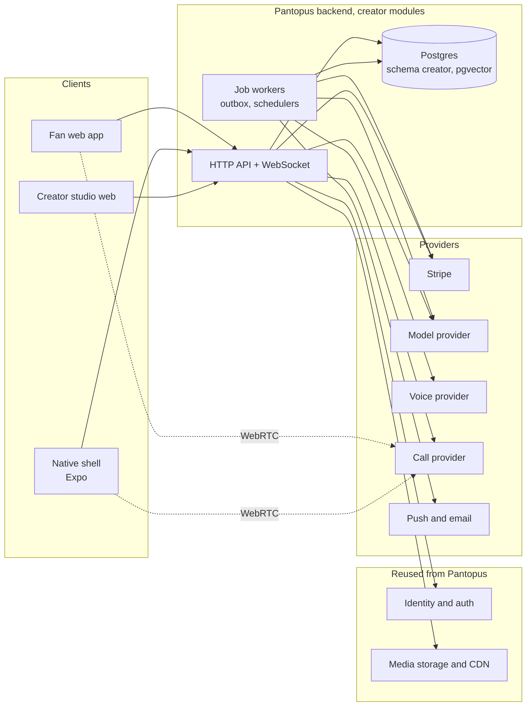
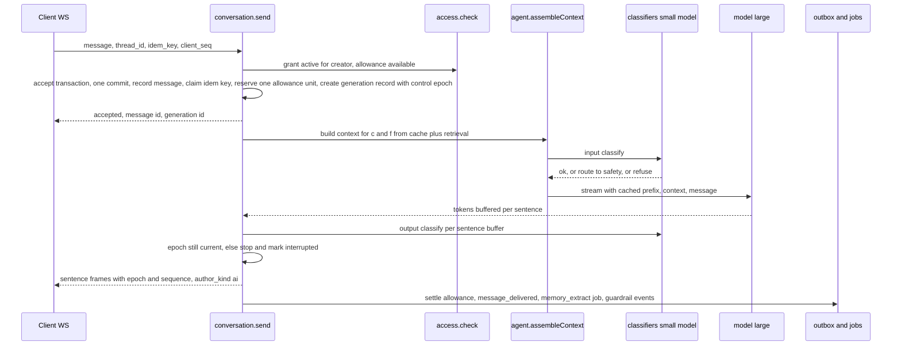
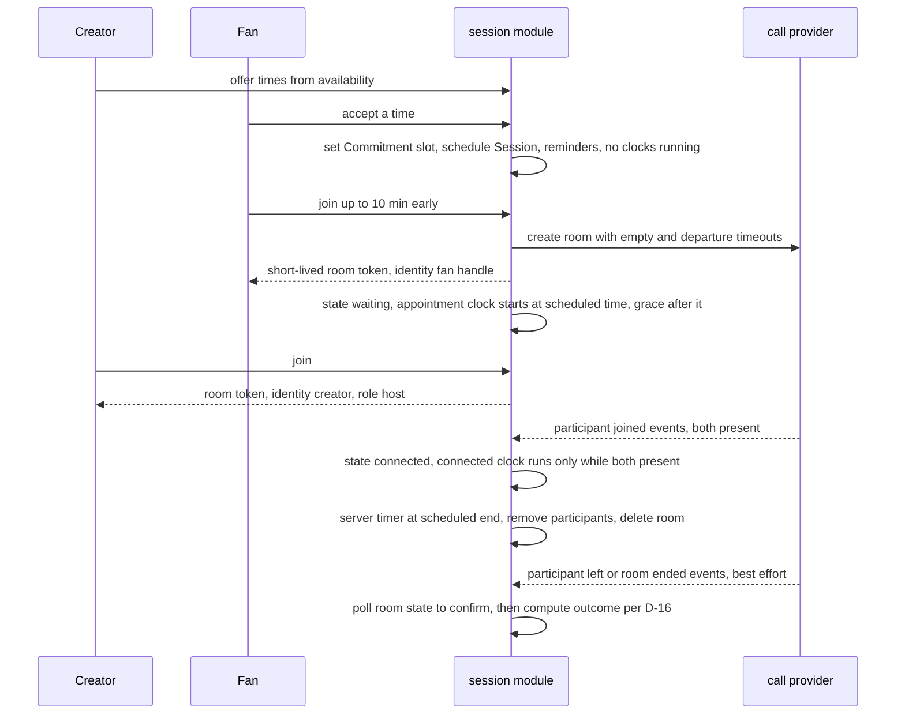

# System Architecture

Sep 22, 2026 · @YP

A modular monolith on the existing Pantopus backend, one Postgres database with thread-scoped tables, an event log, and four external providers (payments, model, voice, calls) behind interfaces. Every module here maps to a family in the [Domain Model and Behavioral Contract](https://claude.ai/artifact/4sbrpzpHMQcjD572JxHGFu), and every screen in the [Product Design](https://claude.ai/artifact/PLKxtG6zHqUj4DM8rB9sYc) reads from exactly one module's API. Where this document assumes something about the Pantopus codebase, it says so; those assumptions are the first thing to check against the repo.

## 1. Architecture decisions

Eight decisions. Each is the cheapest option that honors the invariants; none is the most scalable option, because a solo team's risk is correctness and time, not load.

| # | Decision | Chosen | Rejected | Why |
| --- | --- | --- | --- | --- |
| ADR-1 | Deployment shape | Modular monolith inside the existing Pantopus backend: one codebase, one database, module boundaries enforced by package structure and an internal event bus, deployed as **three runtime pools** from the same image: interactive (HTTP and WebSocket), generation (model calls), and ingestion and insights (source import, embeddings, clustering). Each pool has its own process count, bounded queue, database connection budget, timeouts, and per-creator concurrency limit. | Separate microservices per domain family; a single undifferentiated process pool | One team, one deploy. The product doc's boundaries are logical; a monolith honors them at a fraction of the operational cost. A schema boundary does not isolate CPU, memory, connections or deploy failures, so the pools do: a creator importing an archive cannot starve a fan's message or a scheduled call. Split along the module seams later if a module needs its own scaling. |
| ADR-2 | Datastore | One Postgres database, new schema `creator`, pgvector for retrieval, row-level security as a second guard behind the repository layer, on a non-owner runtime role | Separate vector DB; a document store for threads | Threads, memory, packets and ledger all need transactions and foreign keys to each other. pgvector is enough for per-creator corpora (thousands of chunks, not millions). |
| ADR-3 | Consistency for money, capacity and allowance | Postgres row locks (`SELECT ... FOR UPDATE`) on Capacity, Commitment and Grant allowance rows; an idempotency table keyed by client key; a transactional outbox for our own events; a separate verified inbox for provider webhooks | Redis counters; optimistic retries | Capacity, holds and the last unit of allowance are the places a race costs money or a promise (INV-10, INV-16, INV-18). A lock is simpler to prove correct than a counter plus reconciliation. |
| ADR-4 | Payments | Stripe: PaymentIntents with manual capture for human modes, Billing for pass and tiers, Connect (Express) for creator payouts, behind a `PaymentProvider` interface; the authorization lifecycle (requires\_action, requires\_capture, capture\_before) is modeled explicitly, not assumed | A second processor from day one | Manual capture gives hold-then-capture natively; Connect handles creator KYC and 1099s. The interface lets D-D change later. In the native app, in-app purchase handles the pass and tiers per D-14. |
| ADR-5 | Model access | One `ModelProvider` interface with two tiers: a small fast model for classifiers and memory extraction, a large model for replies; a stable cached prefix per version; streaming to the client | Fine-tuning per creator; a single model for everything | Style comes from retrieval of real replies, not weights. Two tiers keep a message near a cent and classifiers well under it. |
| ADR-6 | Calls | A managed WebRTC provider (LiveKit Cloud recommended; Daily as the alternative) behind a `CallProvider` interface; rooms created and closed by the Session module; the ending, the clocks and the outcome are ours (the provider has no maximum-duration setting and its webhooks are best-effort, so we poll room state to reconcile) | Self-hosted SFU; Twilio Video | Managed WebRTC removes months of media engineering. The Session state machine stays ours; the provider only moves media. |
| ADR-7 | Realtime to clients | One WebSocket connection per client session, multiplexing thread messages, typing and control changes, request status, and call signaling; frames carry a control epoch, generation id and sequence number; server pushes from the outbox | Polling; SSE per thread; provider chat | Takeover (INV-03) needs an ordered delivery boundary, and calls need signaling anyway. |
| ADR-8 | Voice | A `VoiceProvider` interface (ElevenLabs recommended) for asynchronous voice notes only; the audible label is concatenated server-side into every AI note; consent record required before any generation | Real-time voice; provider-side labeling | D-H defers real-time voice. Server-side concatenation means the label cannot be stripped by a client. |

Added in the second review:

| # | Decision | Chosen | Rejected | Why |
| --- | --- | --- | --- | --- |
| ADR-9 | Proving a human act | WebAuthn challenge binding. For each named act the server builds a challenge from a random nonce plus the SHA-256 of a canonical record (act type, thread or Note id, content hash, time); the client calls `navigator.credentials.get` with user verification required; the server verifies signature, user-verification flag, relying party and challenge, and stores the assertion in `signed_act`. Only credentials registered to the creator's own account qualify; team members register their own. Native apps use the platform passkey APIs. Lost device: re-verify through Pantopus identity and the external proof before a new passkey is registered; named acts are unavailable until then | A password session; server-side attestation by role | WebAuthn Level 3 (W3C Recommendation, August 2026) has no transaction-signing extension, so binding the challenge to the content hash is the standard pattern. The authenticator does not display what it signs, so the studio shows the exact content on the signing screen |
| ADR-10 | Provenance for audio | Human voice notes arrive as Opus in WebM, are transcoded server-side to M4A, and receive a platform-signed C2PA manifest ("recorded by a person", account, signed act). AI audio receives a C2PA manifest declaring algorithmic media plus an audio watermark, meeting the two-layer marking the EU Code of Practice asks for. The verification page reads our records, not the file, since re-exports can strip credentials | Spoken tag alone | EU AI Act 50(2) from August 2, 2026; the open-source C2PA SDK supports M4A, MP3, WAV and FLAC but not Opus or WebM |
| ADR-11 | Notes at scale | Fan-out on read: a Note is one row; a thread's timeline query merges the thread's messages with Notes whose audience rule the fan's grants satisfy at read time; each fan has a read cursor. Push notifications fan out through a job with a per-creator rate | Writing one message row per fan | A creator with 50,000 members posts one row, not 50,000; revoking a membership hides past Notes immediately without a rewrite |
| ADR-12 | Model routing | The existing input classifier also labels each turn: short social, knowledge, first turn, sensitive. Short social turns go to the small model with the same cached prefix; the rest go to the large model. Each message records its cost; the allowance is debited in cost units | One model for every turn | Companion traffic is many short turns; routing them is the difference between a pass that loses money on iOS and one that does not (Second Review, section 6) |

## 2. System context

Three clients, one backend, two Pantopus services reused, and six external providers. Everything the model touches goes through the backend; no client ever calls a model, a payment API or a media API with its own credentials except the browser's WebRTC connection to the call provider using a token the backend minted.

Solid arrows are server calls; the dotted arrows are the only client-to-provider path, and they carry a short-lived room token. Webhooks from Stripe and the call provider arrive at the API and are written to the outbox before any state changes.

| Dependency | Used for | Failure behavior |
| --- | --- | --- |
| Pantopus identity | Sign-in, Account.id, session tokens | No sign-in; existing sessions continue to their expiry |
| Pantopus media storage | Content media, attachments, voice notes, call recordings when consented | Uploads fail closed; threads continue in text |
| Stripe | Holds, captures, refunds, subscriptions, Connect payouts | Packet stays draft (nothing shared); subscriptions retry per Stripe; payouts delayed, ledger unaffected |
| Model provider | Replies, classifiers, memory extraction, summaries, style cards | Thread enters "AI updating" state (section 8 of the product design); requests still work; a second provider can be configured for failover |
| Voice provider | AI voice notes, style-consistent only after consent | Fall back to text reply with a note; never a human voice substitute |
| Call provider | Rooms, tokens, recording, webhooks | Session enters reconnecting then ended; Commitment goes to resolution\_required, not delivered |
| Push and email | Notifications, digests | In-app notification remains the source of truth |

## 3. Modules

Eleven modules, one per domain family plus notifications, safety and (since the second review) presence. A module owns its tables and is the only code that writes them; other modules call its API or react to its events. The rule that keeps the monolith modular: **no module writes another module's tables, and no request handler joins across modules.** Reads across modules go through the owning module's read interface, or through a read model that the owning modules maintain from events. A read-model builder or a report may join across schemas; a handler may not. Composite screens (Home, the queue) use read models only where measurement shows the join is too slow, not by default.

| Module | Owns (tables) | Exposes (API) | Reacts to (events) | Must never |
| --- | --- | --- | --- | --- |
| identity | creator\_profile, fan\_profile, team\_membership, verification | resolveActor(token), roles, reliability stats | commitment\_delivered, commitment\_resolution (recompute stats) | Read Pantopus private tables; store anything but account\_id from Pantopus |
| access | grant, pass\_subscription, pass\_slot, tier, membership | check(actor, capability, scope), listGrants, cycleTransition | stripe subscription webhooks; slot\_activated | Infer a grant from a UI state; let a pass grant carry depth (INV-07) |
| agent | agent\_version, knowledge\_source, source\_chunk (pgvector), style\_example, voice\_asset, regression\_case | assembleContext(c, f), generate(threadId, message), publishVersion, runBoundaryTests | source\_revoked, version\_retired (cache invalidation) | Accept a fan id from anywhere but the thread; return content outside the fan's grants (INV-08, INV-11) |
| conversation | thread, message, memory, thread\_audit | send(fan), takeover, handback, pauseForFan, readThread (audited), memory CRUD | generation\_complete (control re-check), packet\_decided | Set author\_kind from client or model input (INV-01); deliver after control changed (INV-03) |
| handoff | human\_mode, capacity, packet, approval, commitment | draftPacket, submitPacket, decide(action), deliver, attest | hold\_placed, captured, refund\_done, session\_ended, deadline\_due | Create a Commitment from anything but a creator-account accept (INV-17); mark delivered without the promised service (INV-09) |
| session | session, session\_event | offerTimes, accept, join(token), end, consentRecording | call provider webhooks; commitment\_created | Count waiting time as connected; record without both consents |
| payments | ledger\_entry, idempotency\_key, payout | hold, capture, release, refund, allocatePool, transfer | packet\_submitted, packet\_decided, commitment\_resolution, cycle\_closed | Capture without an accept event; pay out before the dispute window |
| content | content, content\_audience, live\_event | publish, audienceFor(fan), previewAs(tier) | tier changes (re-evaluate visibility) | Create a knowledge source implicitly (CONTENT-03) |
| insights | insight, cluster, recommendation (in schema `creator_insights`) | weeklyDigest, clusters(creator), recommend | message\_delivered (anonymized ETL), content\_published | Expose a thread id or fan id to the creator; read below min-group |
| safety | safety\_case, block, report | report, block, rateLimit, opsAction | guardrail\_event, report\_filed | Feed routing or offers (INV-19) |
| notifications | notification, preference, device\_token | notify(type, recipient, payload) | Every domain event with a recipient | Put restricted text in a push; label a sender wrong |

Added in the second review: an eleventh module, **presence**, owns broadcast, broadcast\_reply, reaction, correction and thanks. It exposes postNote, replyToNote, react, quoteReply, correct and thank, and reacts to membership changes (audience) and safety actions. It must never render a Note without its audience label (INV-24) or accept any named act without a verified signed act (INV-22). Signed acts themselves belong to identity, which exposes `beginSignedAct(actType, contentHash)` and `verifySignedAct(assertion)`. Sponsorships and the replica license belong to agent; spend limits and consolidated billing to payments.

### Event bus

The transactional outbox pattern: a module writes its state change and an `event` row in the same transaction; a worker publishes events in order per aggregate; consumers are idempotent by event id. Events are the ones listed in the domain model, section 6. This is also the audit trail: every state transition of a Packet, Commitment, Session and every ledger movement has an event row with actor, cause, and idempotency key.

### API style

One HTTP API (JSON, versioned path prefix) plus one WebSocket. Each screen in the product design reads from one module's endpoints; composite screens (Home, the queue) use a thin read model that the owning modules maintain from events rather than cross-module joins. Authorization is checked in the module handler from `resolveActor` plus `access.check`, never in middleware alone.

## 4. Data model

One schema, `creator`, in the Pantopus Postgres instance. The design rule: every table that holds fan-facing conversation data carries `thread_id`, and `thread_id` is derived only from the unique pair `(creator_id, fan_id)`. The invariants that can be expressed as constraints are, so a bug in application code fails at the database rather than leaking.

### Tables and the constraints that matter

| Table | Key columns | Constraint or index that enforces an invariant |
| --- | --- | --- |
| creator\_profile | id, account\_id (unique), handle (unique), verification, content\_class, availability | `content_class` enum with `general` only enabled at launch (D-D) |
| fan\_profile | id, account\_id (unique), handle (unique), intro\_card, intro\_share (creator\_id\[\]) |  |
| team\_membership | creator\_id, account\_id, role\[\], revoked\_at | Unique (creator\_id, account\_id) |
| agent\_version | id, creator\_id, version, mode, rules jsonb, style\_card, approval\_policy, state, compiled\_prefix\_hash | Partial unique index: one `state = live` per creator\_id |
| knowledge\_source | id, creator\_id, origin, rights\_evidence, audience\_scope (tier\_id\[\] or null for public), valid\_from, valid\_until, state |  |
| source\_chunk | id, source\_id, creator\_id, embedding vector, text, audience\_scope (denormalized) | Index on (creator\_id) plus ivfflat on embedding; retrieval query always filters creator\_id and audience\_scope before similarity |
| style\_example | id, creator\_id, text, embedding, approved |  |
| grant | id, fan\_id, scope\_creator\_id (null for platform), capabilities\[\], source, valid\_from, valid\_until, allowance, used | Check: source = pass\_slot implies capabilities subset of {ai\_message} (INV-07) |
| pass\_subscription | id, fan\_id, stripe\_subscription\_id, cycle\_anchor, slot\_capacity, message\_allowance, status |  |
| pass\_slot | id, subscription\_id, cycle (date), creator\_id, state, replacement\_of | Unique (subscription\_id, cycle, creator\_id) |
| tier / membership | tier: id, creator\_id, capabilities jsonb, price\_ref, effective\_from; membership: fan\_id, tier\_id, status |  |
| thread | id, creator\_id, fan\_id, control, agent\_version\_at\_open, privacy\_notice\_at, deleted\_at | Unique (creator\_id, fan\_id) |
| message | id, thread\_id, author\_kind, author\_account\_id, content jsonb, version, approval\_id, citations\[\], created\_at, delivered\_at, suppressed\_reason | Check: author\_kind = approved\_draft implies approval\_id not null; trigger verifies approval.approver\_account\_id = thread's creator account and approval.invalidated\_at is null (INV-02) |
| memory | id, thread\_id, kind, text, provenance\_message\_id, edited\_by\_fan, deleted\_at | FK thread\_id; no creator-wide memory table exists (INV-11) |
| thread\_audit | id, thread\_id, reader\_account\_id, role, read\_at | Written on every creator or team read (D-01) |
| human\_mode | id, creator\_id, kind, price\_ref, deadline\_hours, duration\_min, refund\_rule, weekly\_capacity, eligibility, state |  |
| capacity | creator\_id, mode\_id, window\_start, limit, used, reserved | Primary key (creator\_id, mode\_id, window\_start); updated only under row lock |
| packet | id, thread\_id, disclosure jsonb, mode\_id, price\_snapshot, deadline\_snapshot, routing\_reason, state, hold\_ref, submitted\_at, decided\_at, decided\_by | Check: state = submitted implies hold\_ref not null |
| approval | id, message\_id, message\_version, approver\_account\_id, role, approved\_at, invalidated\_at |  |
| commitment | id, packet\_id (unique), provider\_account\_id, mode, deadline\_at, slot\_at, state, delivered\_message\_id, session\_id, attested\_at, resolution | Check: state = delivered implies (delivered\_message\_id or session\_id) and attested\_at (INV-09) |
| session | id, commitment\_id (unique), provider\_room\_id, scheduled\_at, state, connected\_seconds, recording\_consent jsonb, summary\_consent jsonb |  |
| ledger\_entry | id, kind, amount\_cents, currency, refs jsonb, idempotency\_key (unique), created\_at | Append-only: no UPDATE or DELETE grant on this table |
| idempotency\_key | key, actor\_account\_id, request\_hash, response, created\_at | Primary key (key, actor\_account\_id) |
| event | id, aggregate\_type, aggregate\_id, type, payload, actor, created\_at, published\_at | Outbox; index on (published\_at) where null |
| content / content\_audience / live\_event | content: id, creator\_id, format, state, ai\_use\_permission; audience: content\_id, rule jsonb |  |
| safety\_case / block / report |  | Separate from access tables; no FK into packet or capacity |

Added in the second review:

| Table | Key columns | Constraint or index that enforces an invariant |
| --- | --- | --- |
| signed\_act | id, account\_id, credential\_id, act\_type, content\_hash, challenge, assertion, verified\_at | Append-only; unique (challenge). A trigger on message, broadcast, reaction and correction requires a signed\_act whose account is the creator's own account and whose content\_hash matches, for every row shown under the creator's name (INV-22) |
| broadcast | id, creator\_id, body jsonb, audience\_rule, name\_token, signed\_act\_id, published\_at, retracted\_at | signed\_act\_id not null; audience\_rule uses the unified representation (public, tier ids, group ids) |
| broadcast\_reply | id, broadcast\_id, fan\_id, text, created\_at, quote\_consent, quoted\_at | RLS: a fan reads only their own rows; the creator and triage team read replies to their own broadcasts; no policy lets one fan read another's |
| reaction | id, creator\_id, target\_type, target\_id, kind, signed\_act\_id, created\_at | signed\_act\_id not null |
| correction | id, message\_id, creator\_id, text, signed\_act\_id, created\_at | signed\_act\_id not null; message must be author\_kind ai |
| provenance | id, subject\_type, subject\_id, manifest\_type, c2pa\_manifest\_uri, watermark | One row per audio or video object |
| sponsorship | id, creator\_id, brand, aliases\[\], starts\_at, ends\_at, disclosure\_text | Read by the output labeler |
| replica\_license | id, creator\_id, permitted\_uses jsonb, term\_ends\_at, counsel\_attestation jsonb, status, estate\_opt\_in\_id | Check: term\_ends\_at at most 10 years after signing; the agent refuses any use not in permitted\_uses; status change to revoked or suspended publishes a pause event consumed within 5 seconds |
| spend\_limit | fan\_id, monthly\_cap\_cents or null with explicit\_none, pending\_increase jsonb, reminders\_on | Read inside the packet-submission transaction before capacity is reserved |
| thanks | id, target\_type, target\_id, fan\_id, text, share\_with\_digest | Never aggregated into a per-fan ranking |
| memory\_consent, processor\_consent | memory\_id or fan\_id, category or providers, consented\_at, version | memory rows with a sensitive category require a matching memory\_consent (trigger) |
| message (amended) | adds cost\_micros, route (small, large), signed\_act\_id | cost\_micros feeds cost per active fan |

### Retention and deletion jobs

| Job | Runs | Does |
| --- | --- | --- |
| thread\_delete | On fan action | Soft-deletes the thread and its messages and memory for the fan; hard-deletes after 30 days; packets and delivered records keep a redacted copy (D-08) |
| memory\_purge | On fan action | Hard-deletes the memory row and invalidates the thread's context cache |
| source\_revoke | On creator action | Marks source and chunks revoked; invalidates every compiled prefix that included it |
| record\_retention | Nightly | Purges packet disclosure and delivery records older than 12 months; purges call recordings at the consented retention |
| account\_delete | On Pantopus account deletion event | Everything except ledger entries; ledger keeps account\_id hashed |

### Read models

Two denormalized tables maintained from events, so the two composite screens do not join across modules: `fan_home` (threads with last message glyph, open packets, next sessions per fan) and `creator_queue` (commitments due, packets by SLA, capacity per mode per creator).

## 5. The message pipeline

One request, twelve steps. The metric that matters is **time from the fan's send to the first useful, policy-approved sentence on their screen**, not the model's first token, because the pipeline buffers a sentence and classifies it before release. Steps 1 to 5 are synchronous and cheap and end with a durable acceptance; 6 to 9 are the model; 10 to 12 are asynchronous and never block delivery.

The acceptance transaction is what makes a message real: until it commits, the client shows the message as local\_pending and nothing is reserved; after it commits, the allowance unit is held and the fan sees accepted. Two messages racing for the last unit both reach the transaction; the row lock lets one through. If generation then fails, the unit is released; if it succeeds, it is consumed. Streaming with per-sentence output classification is the compromise between latency and safety: the fan sees text early, and a sentence that fails classification is withheld and the stream ends with the fallback line. Nothing already streamed can be unsaid, so the classifier runs on sentence boundaries before each is sent, and the epoch check runs before each frame so a takeover ends the stream between sentences with the delivered text marked interrupted (INV-03).

### Latency budget (p95)

| Step | Budget (p95, warm) | How |
| --- | --- | --- |
| Server acknowledgement of a durably accepted message | 300 ms end to end | Single-row reads and one short write transaction; grants cached per session and invalidated by event on any grant change |
| Context assembly | 150 ms | Compiled prefix from cache; thread tail (last 30 messages) and memory in one query; retrieval is one scoped query over the creator's chunks, top 4 |
| Input classifier | 200 ms | Small model, short prompt, cached system prefix |
| First token from the large model | 800 ms | Prompt cache hit on the version prefix (slots 1 to 3 of the context contract) |
| First sentence generated | 600 ms after first token | Replies capped by the version's length rule (default 120 words); first sentences are short by prompt instruction |
| First-sentence output classifier | 150 ms | Runs on sentence n while sentence n+1 generates |
| **First approved visible sentence** | **2.5 s warm, 4 s cold** | The number the fan feels. Cold means no prefix cache hit (first message on a new version). p99 is published beside p95 |
| Full reply | 8 s | Sum of the above plus the remaining sentences |
| Visible takeover transition | 500 ms | Control change pushed on the ordered channel; client swaps strip and composer on the event |
| Settle allowance, memory extraction, events | Off the critical path | Job worker, within 10 s |

These are targets to validate under a defined device, network, region and load profile, not results. Component p95s do not add to an end-to-end p95; the end-to-end number is measured on its own, warm and cold separately.

### Cost per message (order of magnitude, model prices as of mid-2026)

| Component | Tokens | Cost |
| --- | --- | --- |
| Cached prefix: platform rules, creator rules, style card, 20 fixed examples | 5,000 read from cache | about $0.0005 with a 90% cache discount on a mid-tier model |
| Uncached context, budgeted: 4 source chunks at about 300 tokens (1,200), thread tail (800), memory (300), 5 retrieved examples and the message (200) | 2,500 | about $0.0075 |
| Output | 200 | about $0.003 |
| Two classifier calls | 1,500 total on a small model | about $0.0003 |
| Memory extraction (async, small model) | 1,500 | about $0.0003 |
| Total |  | about one cent on a mid-tier model; three to five cents on a frontier model |

The uncached budget is a hard cap enforced by the assembler, in that order of priority: the message always fits, then memory, then the thread tail (trimmed from the oldest), then chunks (fewer, never truncated mid-chunk). Retrieved examples live after the prefix so the prefix bytes never change between messages and the cache keeps hitting.

At 300 messages per fan per month on the pass allowance, the model cost ceiling per fan is about $3 on a mid-tier model, which is why the allowance exists and why mode selection (a frontier model only for companion-mode replies, say) is a per-version setting. Figures are approximate and must be re-checked against current provider pricing before the pass price is set.

### Workload model

Monthly active users are not an engineering input. The inputs are concurrent WebSockets, generation starts per second, generation duration, provider token throughput, concurrent call participants, ingestion volume, and creator-concentrated bursts (one creator's post sending thousands of fans to one agent in ten minutes).

| Profile | Concurrent WebSockets | Generation starts per second | Concurrent generations (4 s average) | Concurrent call participants | Ingestion |
| --- | --- | --- | --- | --- | --- |
| Pilot (5 creators) | 500 | 2 | 8 | 4 | One archive at a time |
| Design target | 50,000 | 200 | 800, before retries | 400 | 20 archives in parallel |

The design target sets the generation pool's size, the provider's rate limits to negotiate, and the per-creator concurrency cap (a burst on one creator queues behind a fair-share limit rather than consuming the whole pool). Service objectives: 99.9% monthly availability for the interactive API; database recovery point 5 minutes and recovery time 1 hour, with a restore drill before pilot; queue-age alerts on every pool; a degraded mode in which threads are readable and requests submittable while generation is unavailable.

## 6. Agent runtime

An agent is a compiled artifact plus a per-message assembly. Compilation happens at publish; assembly happens per message. Nothing in the runtime holds state between messages except the database.

### Compile at publish

| Step | Produces | Notes |
| --- | --- | --- |
| Render rules | The version's system prompt text (slots 1 and 2 of the context contract), with mode-specific guardrail text selected from platform templates | Deterministic; the same version always renders the same bytes, so the provider's prompt cache hits |
| Build style card | A short description of voice, vocabulary, sentence length, humor, sign-offs, generated once from the creator's approved replies by the large model, editable by the creator | Regenerate only when the creator asks |
| Embed examples | Embeddings for approved StyleExamples | Twenty fixed examples, chosen by the creator or by diversity, live in the cached prefix and never change between messages; five more are retrieved per message by similarity and placed after the prefix, so the examples stay relevant and the cache still hits |
| Ingest sources | Chunks (about 400 tokens, overlap 50) with embeddings and denormalized audience\_scope | Chunking is per source; re-ingest on source edit; revoke marks chunks and invalidates prefixes |
| Run boundary tests | Pass or fail per case: identity disclosure, out-of-scope, restricted-source probe, unsupported opinion, never-reveal probe, instruction override, every filed regression case | Tests run as real pipeline calls against a synthetic fan with chosen grants; results stored on the version |
| Publish | Live pointer moves; compiled prefix hash stored; old version retired | Rollback moves the pointer back without re-testing |

### Assemble per message

The assembler is one function with the signature `assemble(scope: ThreadScope, message)`, where the scope carries the creator id, fan id and thread id and nothing else can be passed in. Its queries are the ones in section 9, each carrying both ids. Retrieval over the creator's chunks: for a corpus under about 50,000 chunks (every pilot creator), an exact scoped scan ordered by cosine distance, `WHERE creator_id = c AND audience_rule_allows(f)` first, so recall is 100% and the audience filter is applied before similarity, never after; for larger corpora, an HNSW index per creator partition with pgvector's iterative scan enabled so filtering cannot starve the result set. Recall is benchmarked per creator at ingestion (does the authorized, relevant chunk appear in the top 4 for a held-out set of their own FAQ questions) before the index strategy is chosen. Top 4 chunks; the 5 nearest style examples; the last 30 messages with their author\_kind; all memory rows for the thread minus exclusions; the intro card if `f.intro_share` contains `c`. The audience rule is one representation, `public | tier ids | group ids`, shared by content, sources and chunks, so a publish-time audience and a retrieval-time filter can never disagree.

### Memory extraction

An asynchronous job after each delivered AI reply and after each human reply: the small model reads the last exchange and proposes zero or more items of kind fact, open\_loop, or summary update, each with the source message id as provenance. The job records the thread revision it read; the write is a conditional update that fails if the thread's revision has moved (a deletion or a newer message), and the job then re-reads or drops. Every proposal is checked against the thread's MemoryExclusion list before writing, so a fact the fan deleted with "don't remember this" is not rebuilt from retained history. Human replies are extracted with provenance pointing at the human message, which is how a later AI turn can say "Maya suggested checking the flux ratio." Open loops close when a later extraction marks them resolved. The rolling summary is regenerated when the thread passes 60 messages and every 40 after; deleting a memory item also queues a summary regeneration and a prompt-cache invalidation, and deleting a thread purges its chunks of any embedding index.

### Guardrails

| Layer | Implementation |
| --- | --- |
| Code limits | Daily cap per fan and allowance: counters on grant; forbidden-topic and never-reveal lists: normalized substring and regex match on the output buffer before the classifier, so a phone number in the never-reveal list is caught even if the model paraphrases the rest |
| Input classifier | Small model, structured output: {ok, refuse\_code, route\_safety}; the prompt lists the mode's categories |
| Output classifier | Small model per sentence buffer, structured output over the never list of the product design section 2: impersonation, creator-memory claim, promise of time, romantic or exclusive framing, private detail, and for expert mode, an unsupported factual claim (checked as "is this sentence supported by the cited chunks") |
| Fallback | A per-mode fallback line replaces the withheld sentence and ends the stream; a guardrail\_event row records the category, the version, and the withheld text for the creator's Threads view |
| Regression | "I'd never say that" writes a regression\_case with the AI output, a paraphrased prompt (creator-written or AI-generated), and the creator's one-line rule; the fan's message is never copied into the case (D-13); the rule is appended to the draft version's rules; the case runs at the next publish |

Added in the second review:

| Layer | Implementation |
| --- | --- |
| No selling (INV-21) | The output classifier gains a "sales pressure" category: suggesting a purchase, naming a price, or implying the creator's attention can be bought. A withheld sentence is replaced, never rephrased by retry. Limit handlers (trial, allowance, spend cap) take effect at the start of the fan's next message after the AI's reply completes, and never while the input classifier has flagged distress in the last three turns |
| Sensitive memory (INV-23) | The extractor tags each proposal with a category. A sensitive proposal without consent is dropped, and the next AI turn may ask once ("Want me to remember this?"); a yes writes the item and a memory\_consent row |
| Sponsor labels (INV-25) | A deterministic pass over the output matches the creator's active sponsorship brands and aliases and appends the disclosure line inside the message. The system prompt forbids first-hand claims; the output classifier checks for them when a sponsor is mentioned |
| Notes as context | Recent Notes the fan can see are retrieved as creator-scoped context (slot 4) so the AI can discuss them. The AI is told it cannot know whether the creator read any reply |
| Shadow evaluation | Before publishing a version: replay a weekly sample of about 200 scrubbed paraphrases of recent fan prompts (creator-scoped, no fan identifiers, kept 30 days) against the draft and the live version; score grounding, style, guardrails and sales pressure with a judge model; the creator sees the differences before publishing |

### Voice notes

When a creator has a VoiceAsset with a consent record (a recorded statement plus a signed acknowledgement, stored with the asset) and the reply is eligible (mode setting, fan preference), the reply text goes to the voice provider after the output classifier passes the full text. The server concatenates a fixed one-second spoken label ("Maya's AI") ahead of the generated audio, stores the file in media storage, and delivers a message with content type audio and author\_kind = ai. The label is in the file, so no client can render an unlabeled AI voice. Human voice notes are uploaded by the creator and stored as author\_kind = human\_creator; they get no synthetic label.

## 7. Handoff, capacity and money

Three places where a race or a retry costs real money or a broken promise, each handled with a Postgres row lock, an idempotency key, and a state machine that only the application advances.

### Packet submission (the one transaction that touches capacity and Stripe)

1. Client sends `submitPacket(draftId, modeId, disclosure, idem_key)`.
2. Handler checks the idempotency table; a hit returns the stored response.
3. In one transaction: `SELECT ... FOR UPDATE` on the capacity row for (creator, mode, this week); if `used + reserved >= limit`, roll back and return `capacity_full` with the next window start. Otherwise `reserved += 1`, packet state becomes `submitting`, paymentState `authorization_pending`, and the transaction commits.
4. Outside the transaction: create and confirm a Stripe PaymentIntent with `capture_method: manual`, amount = price snapshot, idempotency key = packet id. The outcome is one of: `requires_action` (the bank wants authentication; the fan completes it in the checkout sheet; the packet waits in `submitting` for up to 30 minutes), `requires_capture` (authorized; read `capture_before` from the charge and store it as the hold's expiry), a decline (compensating transaction: `reserved -= 1`, packet back to `draft`, return `payment_failed`; nothing was shared), or a timeout (paymentState `unknown`; a reconciliation job fetches the intent's current state and resolves it; the packet stays in `submitting` and the fan sees "confirming payment").
5. On `requires_capture`: packet state `submitted`, `hold_ref` and `hold_expires_at` stored, `packet_submitted` event in the outbox, response cached under the idempotency key.

The hold's real expiry is the charge's `capture_before` (seven days for most customer-initiated card payments, five for some, longer for a few methods), never an assumed constant. The packet's decision window is `min(creator SLA, hold_expires_at - 6 h)` and the expiry scheduler fires then. A "more information requested" state pauses the creator's SLA clock but cannot pause the authorization clock; if the hold would expire while the packet waits, the fan is asked to re-authorize (a new intent replaces the old, same packet, same idempotency lineage) or to withdraw. Stripe's automatic delayed capture and extended authorizations are options to evaluate once eligible; the model does not depend on them.

### Decision and capture

| Action | Transaction | Stripe | Capacity | Events |
| --- | --- | --- | --- | --- |
| accept | Packet `accepted`; Commitment created with deadline = now + mode deadline; lock capacity row | `capture` (idempotency key = packet id + "capture") | `reserved -= 1`, `used += 1` | packet\_decided, commitment\_created, captured |
| decline / expire / withdraw | Packet to the terminal state | `cancel` the intent | `reserved -= 1` | packet\_decided, hold\_released |
| more\_info | Packet `more_info`; SLA clock paused; hold unchanged | none | unchanged | packet\_decided |
| deliver (creator message or session ended) | Commitment `delivered` with attestation; delivered\_message\_id or session\_id set | none | none | commitment\_delivered |
| deadline missed / creator no-show | Commitment `resolution_required` then `refunded` | `refund` (idempotency key = commitment id + "refund") | none | commitment\_resolution, refunded |

Capture happens on accept, not on delivery, because the deadline can exceed the seven-day hold (D-02). If capture fails (card died between hold and accept), the accept is rolled back and the creator sees "payment failed, fan notified"; the packet returns to `submitted` with a 24-hour re-authorization window.

### Schedulers

Delayed jobs, persisted in the database, keyed by the aggregate id so a re-scheduled deadline replaces the old job:

| Job | Fires at | Does |
| --- | --- | --- |
| packet\_expiry | submitted\_at + min(SLA, 7 d) | Expire if still submitted |
| commitment\_deadline | accepted\_at + mode deadline | Move to resolution\_required if not delivered; trigger refund; notify both |
| session\_reminders | scheduled\_at minus 24 h, 1 h, 10 min | Notify both |
| session\_no\_show | scheduled\_at + grace | Apply D-03 |
| cycle\_close | 1st of month 00:05 UTC, per subscription time zone batch | Slot transition (F10), then pool allocation |
| payout\_release | commitment delivered + dispute window (7 days) | Transfer to the creator's Connect account |

### Pool allocation

At cycle close, one job per cycle: `pool = sum(pass captures for the cycle) - platform take - refunds`. Count active slot-days per creator (a replacement counts for its days). Each creator's share = pool multiplied by their slot-days over total slot-days. Write one `pool_alloc` ledger entry per creator with the slot count and slot-days in `refs`, so the creator's earnings screen can show "selected in 38 slots of 1,120." Allocation is idempotent by (cycle, creator). Transfers follow the payout\_release rule.

### Ledger discipline

Two logs with different jobs. The **webhook inbox** stores every verified provider event (Stripe, the call provider) exactly once by provider event id before anything reacts to it; processing is idempotent, order-independent, and derives state from a current-state fetch when the event is ambiguous, because providers document that delivery can be duplicated, delayed, or missing. The **transactional outbox** carries our own committed domain events to consumers. Neither substitutes for the other. The ledger is append-only; balances are views. A nightly reconciliation compares ledger holds, captures and refunds against Stripe's balance transactions and the inbox, and opens a safety case on any mismatch or any intent stuck in `unknown` for more than an hour.

### Spend limits and billing (added in the second review)

- **Spend limit before capacity.** Inside the packet-submission transaction, before the capacity row is locked, the handler sums this month's captures and open holds for the fan; if the new price would exceed the fan's limit, it refuses with `spend_limit` and nothing is reserved or held. A raised limit is stored as pending with an effective time 24 hours out; lowering applies at once.
- **One charge per fan.** A fan's memberships (and the pass, when it exists) are items on one Stripe subscription, so one invoice and one fixed card fee per month. Adding or removing a membership prorates the items.
- **Refunds on memberships.** A membership unused within 7 days of purchase (no AI message, no Note opened, no request) is refunded in full on cancellation; after that, pro-rated. Both are ledger entries with cause.
- **Cost per active fan.** A nightly job sums message cost\_micros per fan per plan and alerts when a plan's 90th-percentile fan exceeds its budget.

## 8. Realtime and calls

One WebSocket per client carries everything that must arrive within a second: message chunks, typing, control changes, request status, and call signaling. Media never touches our servers; the call provider moves it, and our Session module owns the state.

### Thread transport

| Concern | Design |
| --- | --- |
| Connection | One authenticated WebSocket per client session; subscriptions by thread id and by "my requests"; reconnect with a cursor (last event id) so nothing is missed |
| Message delivery | AI replies stream as chunks tagged with message id and author\_kind; the final chunk carries citations and memory chips; the client renders the label from the first chunk, not the last |
| Control changes | `thread.control` changes are pushed as a system message and a state event in the same frame; the client swaps the identity strip and composer on the event, not on the next message |
| Takeover | The creator's `takeover` handler: lock the thread row, set control = human\_active, write the system message, publish the event, and set a `cancel` flag the streaming handler checks between sentences. The in-flight generation stops at the next sentence boundary; text already delivered stays on the fan's screen labeled interrupted, and no further frame from that generation is delivered (INV-03). Ordering is guaranteed by the epoch protocol below, not by timing |
| Presence | Creator presence in a thread is a WebSocket subscription, shown to the fan only while control = human\_active; the AI never shows presence |
| Backpressure | Per-connection send queue with a cap; a slow client is disconnected and resumes from its cursor |

### The delivery boundary protocol

Already displayed text cannot be discarded, so takeover is a delivery protocol, not a cancellation.

| Element | Rule |
| --- | --- |
| Control epoch | A monotonically increasing integer on the thread, incremented by every control change: takeover, handback, pause, resume, block, revocation |
| Generation id and sequence | Every AI generation records the epoch it started under; every frame it emits carries (generation id, sequence number) |
| Server gate | Before sending any frame, the sender re-reads the thread's current epoch under the same ordered per-thread channel; a frame from a generation whose epoch is older is not sent, and the generation is marked interrupted at the last delivered sequence |
| Boundary event | A control change is itself a frame on the same channel carrying the new epoch; it is delivered in order after any frame already committed to the channel and before any frame from a newer epoch |
| Client gate | The client tracks the highest epoch it has rendered; a frame whose epoch is lower than that is dropped even if it arrives late over a reconnect; a frame with a higher epoch than the last boundary it saw is held until the boundary arrives |
| Multiple devices | Each device applies the client gate independently from its own cursor; the server never assumes a device is current |
| Reconnect | Resume from the cursor replays frames in channel order, including boundaries, so the gates produce the same result as a live connection |

The observable promise: after the fan's interface shows that the creator is present, no AI text appears beneath that line. The same protocol covers handback (new epoch, AI frames resume), pause (no AI frames until resume), and revocation (thread to ai\_paused, no frames).

### Calls

| Rule | Implementation |
| --- | --- |
| Three clocks (D-16) | **Appointment**: starts at the scheduled time regardless of who has joined; the grace period counts from it. **Connected**: accumulates only while both participants are present per provider state; this is the only clock that counts toward delivery. **Reconnection allowance**: a fixed budget per session (default 3 minutes total) that the connected clock pauses against during a drop; when exhausted, the session ends as technical\_failure unless one side ended it |
| Fixed end, no overtime | The provider has no maximum-duration setting, so the Session module owns the end: a durable scheduled job at the scheduled end plus allowance removes both participants and deletes the room; the room's empty and departure timeouts are set short as a backstop; the client timer is cosmetic |
| Outcome | Computed by the Session module from its own clocks and the reconciled participant history, never from a single webhook: completed (connected at least 80% of duration, or the fan ended early by choice), partial (creator ended early; pro-rated refund of unconnected minutes), creator\_no\_show (grace passed, creator absent), fan\_no\_show (grace passed, fan absent; captured as disclosed), technical\_failure (allowance exhausted, neither side ended; rebook or refund, no reliability hit) |
| Early joining | Creates the room and issues a token; starts no clock and cannot produce a no-show before the grace period after the scheduled time |
| Webhooks are best-effort | Provider events land in the webhook inbox and update state, but no outcome is recorded until the module has polled the room's participant list at the end and reconciled; a missing ended event is detected by the end-of-session job |
| Reconnect | The same room and a fresh token within the allowance; the same participant identity does not create a new session |
| Recording | Off by default at the room level; enabled by a server call only when both `recording_consent` entries exist; the consent switch is in-call, and turning recording on shows on both clients from the server event, not from the local click |
| Recording storage | Provider egress to our media storage; retention per consented policy; AI reuse requires a separate consent (INV-12) |
| Identity on the call | The token's identity string is the authorship label; the client renders the chip from the token claims, and a token for the creator role is only minted for the creator's own account, never a team member, for a personal-mode session (INV-09) |
| Post-call summary | Only with both `summary_consent`; generated from a transcript that exists only if recording was consented; otherwise the summary is from the packet plus a creator-typed note |
| Real devices | Backgrounding, interrupted audio, locked screen, Bluetooth changes and reconnects are tested on real iOS and Android devices as part of slice 2's definition of done |

### Native shell specifics

The Expo shell registers for CallKit (iOS) and ConnectionService (Android) so an incoming scheduled call rings like a call and survives backgrounding; the WebSocket reconnects on foreground with its cursor. Push tokens are stored per device in the notifications module.

## 9. Isolation in practice

Isolation (INV-11) is enforced three times: in the type system, in the database, and in a property test. Any one of them alone is a bug away from a leak; the feed coordinate leak Fable mentioned is the same class of mistake, and this is the answer to it.

### Layer 1: the ThreadScope type

Every repository function that reads or writes thread, message, memory, packet, or thread\_audit takes a `ThreadScope` value as its first argument, and `ThreadScope` can only be constructed by `access.openThread(actor, creatorId, fanId)`, which verifies the actor is that fan, that creator, or a team member with the triage role (and writes the audit row for the latter two). There is no repository function that takes a bare fan id or creator id for these tables. The assembler's signature in section 6 is the same idea one level up. In TypeScript this is a branded type; in any language it is a constructor that is private to the access module.

### Layer 2: row-level security

Postgres RLS policies on the thread-scoped tables, keyed on session variables `app.creator_id` and `app.fan_id`. The application connects as a **non-owner runtime role** with `NOBYPASSRLS`; the table owner and any superuser are never used at runtime, because owners bypass RLS unless forced and privileged roles bypass it always. Policies are explicit for SELECT, INSERT, UPDATE and DELETE. The handler sets the variables with `SET LOCAL` inside the transaction from the ThreadScope, so tenant context never persists on a pooled connection; a query with no scope set returns nothing. Job workers set the scope per job from the aggregate they process. The insights ETL runs as a separate role with read access to an anonymized view, not to the base tables.

### Layer 3: the property test (T-11)

Seed 100 fans and 1,000 threads across 10 creators with distinctive marker strings in every message, memory row, attachment and regression case. For 10,000 random (creator, fan) pairs, run the assembler and assert that the context contains only markers from that pair plus that creator's public material. Run it in CI on every change to the agent, conversation, access or media modules, and nightly against a production-shaped dataset. It instruments every SQL statement the assembler issues and checks the predicate appropriate to each data family: thread-scoped tables (message, memory, packet, thread\_audit, attachments) must carry both creator\_id and fan\_id or a thread\_id; creator-scoped tables (source\_chunk, style\_example, regression\_case) must carry creator\_id and an audience predicate evaluated against the fan's grants; platform tables need neither. A statement missing its family's predicate fails the build.

### Scope beyond retrieved chunks

The same contract covers everything that can reach a fan or a model: attachments and voice notes are served through signed URLs minted per thread with a short lifetime and the thread id in the signature; memory is loaded only through the scope; regression cases contain no fan text (D-13); prompt caches are keyed by version and grant version so a revoked grant cannot hit a cached context; and revocation is event-driven, not timeout-driven: a grant, source or version change publishes an invalidation that every cache consumes, with a bound of 5 seconds from the change to the last cache, enforced by a test that revokes and immediately re-assembles.

### What is deliberately not isolated

| Data | Who sees it | Path |
| --- | --- | --- |
| A creator's own threads | The creator and triage-role team | `openThread` with an audit row per read (D-01); the fan's Me screen lists these rows |
| Aggregate themes across a creator's threads | The creator | The insights ETL: messages are stripped of fan ids and handles, clustered, and only clusters at or above the min-group size (default 5 distinct fans) are written to `creator_insights`; the raw view is not queryable by the creator role |
| Packet disclosure sets | The creator and team by role | Copied into the packet at submission; the packet is not a pointer into the thread, so later thread deletion does not alter what the creator was shown |
| Guardrail events | The creator (category, version, withheld text) and ops | Written by the pipeline with the thread id; the creator's view goes through `openThread` |

### Audit

`thread_audit` is append-only and has its own retention (indefinite while the thread exists). The fan's "Who has read my conversations" is a direct query on it. Ops reads use a distinct role value and a case id, so a fan can see that ops read a thread and why category, without the case content.

## 10. Shared with Pantopus versus new

The line: Pantopus provides the account and the infrastructure; the creator platform provides everything a fan or creator can see. Only `account_id` crosses the boundary in either direction. The rows below marked "confirm" are assumptions about the Pantopus codebase; the first engineering task is to check them.

| Area | Reuse from Pantopus | New here | Boundary rule |
| --- | --- | --- | --- |
| Accounts and auth | Sign-in, sessions, tokens, account lifecycle events (confirm: token format and how a second app validates it) | creator\_profile, fan\_profile keyed by account\_id | The creator schema never joins Pantopus user tables; it stores account\_id and nothing else from them (INV-14) |
| Persona and audience identity | Fable notes a persona layer and an audience-identity table exist (confirm) | AgentVersion hangs off the persona; Thread pairs persona and audience identity | If the persona table carries address or neighborhood fields, the creator profile references the persona id but the API never returns those fields |
| Payments | Stripe platform account and Connect onboarding if present (confirm); otherwise a new platform account | PaymentProvider implementation, ledger, holds, pool allocation | Ledger is in the creator schema; Pantopus balances are never mixed |
| Media | Object storage, CDN, upload signing, image processing (confirm) | Voice note pipeline, recording egress, attachment scoping by thread | Every object key is prefixed by module and thread or content id; Pantopus listing paths never include creator objects |
| Messaging | DM threads, blocks, quotas exist per the concept doc (confirm) | Reuse the block and quota primitives; do not reuse DM threads (author\_kind, control state, and RLS are new requirements) | A creator thread is a new table, not a DM thread with extra columns |
| Scheduling | A scheduling suite for availability and booking (confirm) | Session state machine, provider integration | Reuse availability windows; the Session is new |
| Broadcast | Broadcast channels for publishing (confirm) | Content audience rules, AI-use permission | Reuse delivery; audience resolution is new because tiers are new |
| Push and email | Device tokens, push sending, email templates (confirm) | Notification types and sender labels | Sender label is set here, never by the shared sender |
| Moderation and ops | UGC moderation tooling from the store launch (confirm) | SafetyCase, guardrail events, agent pause | Ops actions on creator objects go through the safety module's API |
| Infrastructure | GCP project, CI/CD, EAS builds, Postgres, secrets, logging (confirm) | Schema `creator`, job workers, WebSocket server | Same deployable; feature-flagged so Pantopus releases are unaffected |
| Client apps | Expo toolchain, design tokens where useful | Fan web app, creator studio web, and the fan native shell as a separate app bundle | A separate app listing; the Pantopus app never shows creator screens (D-A) |

### Why the same deployable and database

One team, one on-call, one migration history. The cost is discipline: the `creator` schema, the module boundaries, and the feature flag are what keep a creator-platform incident from touching Pantopus. If the creator platform later needs its own scaling or its own team, the schema and the module seams are the extraction points, and the only shared dependency to replace is `resolveActor`.

## 11. Security, compliance and operations

The trust-sensitive parts are disclosure, consent, and isolation; the operationally sensitive parts are money and calls. Each has a concrete mechanism, not a policy statement.

### Disclosure and consent records

| Requirement | Mechanism | Source of the requirement |
| --- | --- | --- |
| A fan always knows they are talking to an AI | author\_kind on every message; label rendered into content; audible label in voice notes; identity strip; the never-list output classifier; disclosure at the start of every thread and a reminder every three hours of continuous use (D-11) | California SB 243 (effective January 1, 2026; private right of action, $1,000 per violation), New York's AI companion law (effective November 5, 2025), Oregon and Washington (2027, private rights of action), EU AI Act Article 50 (applies from August 2, 2026), California's bot disclosure law |
| Companion-chatbot safety protocol | Suicide and self-harm detection in the input classifier with a crisis-referral response that never offers paid access; a published protocol page; counters for referrals kept for the annual report due from July 1, 2027; sexual content blocked (D-D); a prominent "may be unsuitable for minors" notice even though fans are 18+ | SB 243 and the New York law |
| Fan age | 18+ enforced through the Pantopus account; under-18 accounts see the policy and get no partial access (D-11) | SB 243 minors provisions, Character.AI's November 2025 under-18 cutoff and January 2026 settlements as the market signal |
| Voice cloning consent | VoiceAsset stores the consent recording, a signed acknowledgement, the account that gave it (must be the creator's own), and a revocation path that deletes generated notes' ability to be re-rendered | Right-of-publicity and voice-likeness statutes vary by state; the record is what a dispute needs |
| Per-event consents | Recording, summary, reuse, sharing a reply, training: each a row with actor, session or thread, timestamp, and revocation; never a boolean on a profile (INV-12) | Product doc section 13 |
| Creator thread access | thread\_audit row per open; fan-visible as "Conversation access history" | D-01 |
| Deletion and export | Jobs in section 4; export produces the fan's threads, memory, packets and consents as JSON plus media links, per creator; the deletion screen states the 12-month retention exception for packets and delivery records | Privacy regimes with access and erasure rights |
| Creator data portability | Export of sources, rules, style card, examples and versions; deletion on leaving | Supply-side trust; no lock-in |

Added in the second review:

| Requirement | Mechanism | Source of the requirement |
| --- | --- | --- |
| Machine-readable marking of synthetic audio; disclosure of deepfake audio even with the person's consent | ADR-10 manifests and watermark on AI audio; the audible and visual AI label | EU AI Act 50(2) and 50(4), from August 2, 2026; the Commission's Code of Practice (June 2026) |
| Consent before sending personal data to third-party AI | processor\_consent before the first AI message, naming providers; no-retention and no-training terms with providers | Apple guideline 5.1.2(i) (November 2025) |
| Sensitive data in chat memory | INV-23 and memory\_consent | GDPR Article 9; Italy's €5M Replika fine (2025) |
| Paid endorsements by an AI in the creator's voice | Sponsorship registry and in-message labels (INV-25); logged sponsor instructions | FTC Endorsement Guides (covering virtual influencers), fake-testimonials rule (October 2024), proposed output-steering policy (July 2026); Cameo's attorney-general settlement |
| Digital replica contracts and death | replica\_license as enforced data; pause on revocation or death; estate opt-in | California AB 2602 and AB 1836; New York GOL 5-302 and post-mortem law; Tennessee ELVIS Act; NO FAKES (pending) |
| Memory-bearing companion AI | Existing disclosure and three-hour reminder; crisis protocol | New York GBL Article 47 expressly covers AI that remembers past interactions |
| In-app reporting of AI output | Report on every AI message (existing) | Google Play AI-Generated Content policy |
| Fan-membership refunds | 7-day unused full refund, pro-rated after | Korea Fair Trade Commission order, June 2026 |

### Abuse and rate limits

| Vector | Control |
| --- | --- |
| Trial farming (new accounts for free messages) | Trial grant keyed to Pantopus account\_id, which already carries address-level verification; five lifetime messages per creator; device fingerprint as a secondary signal |
| Prompt injection via fan messages or uploaded attachments | Input classifier; attachments are described to the model as text extracted by a separate step, never as raw instructions; the version's rules are in the cached prefix ahead of any fan content |
| Injection via knowledge sources | Sources are evidence, not instructions (AI-03); the render step wraps chunks in a data envelope and the boundary test "instruction override" covers it |
| Harassment of creators through packets | Packet rate limit per fan per creator (default 3 open at once); block ends everything; reports go to safety |
| Creator impersonation at onboarding | External proof plus manual review for high-profile names; a denylist of names that require review |
| Payment fraud | Stripe Radar; hold before share; chargeback opens a safety case and revokes the fan's grants pending review |
| Model cost runaway | Allowance per grant; daily cap per fan per creator; per-creator monthly model budget with a soft alert and a hard pause |

### Observability and SLOs

| Signal | Target | Alert |
| --- | --- | --- |
| Server acknowledgement of an accepted message | p95 under 300 ms | Over 600 ms for 5 min |
| First approved visible sentence | p95 under 2.5 s warm, 4 s cold; p99 published | Warm p95 over 4 s for 5 min |
| Visible takeover transition | p95 under 500 ms | Over 1 s for 5 min |
| Revocation to last cache | Under 5 s, always | Any measured violation pages |
| Message pipeline error rate | Under 0.5% | Over 2% for 5 min |
| Guardrail block rate per version | Tracked; a jump after publish is a regression signal | Over 3x the version's baseline |
| Isolation property test | Green on every deploy and nightly | Any failure pages, deploy blocked |
| Hold-to-decision, decision-to-delivery | Per creator, feeds reliability stats | Overdue commitments over 5% of active |
| Ledger and inbox reconciliation | Zero mismatches nightly; no intent in `unknown` over 1 h | Any mismatch opens a case |
| Call connect success | Over 97% of scheduled sessions reach connected | Under 90% in a day |
| Call outcome without reconciliation | Zero | Any outcome recorded from a single webhook pages |
| Queue age per pool | Interactive under 1 s; generation under 5 s; ingestion under 10 min | Sustained breach |
| Availability | 99.9% monthly for the interactive API; RPO 5 min; RTO 1 h; restore drill before pilot and quarterly |  |
| WebSocket reconnect success | Over 99% resume from cursor |  |

Logs never contain message text at the info level; a message id and the thread id are enough. Guardrail events store withheld text in the database, not in logs. Secrets for the four providers live in the platform's secret manager with rotation, and provider calls go through the interface types so a provider swap is a configuration change plus an adapter.

### Runbooks that must exist before pilot

Model provider outage (flip to secondary or enter AI-updating state); call provider outage (sessions to resolution, refunds, rebooking notice); Stripe webhook backlog (replay by event id); a suspected isolation leak (freeze the assembler, run the property test against production data, audit thread\_audit and events for the window); creator authorization revoked (pause agent, resolve commitments, notify fans, slot replacements).

## 12. Build sequence

Five slices, each shippable to a closed pilot, each proving one thing, in the order the founder chose on September 23, 2026 (D-23 to D-26): membership first, full build as sliced, the pass once the roster supports it. Effort assumes one senior engineer with AI coding assistance, the Pantopus backend as the base, and the "confirm" rows of section 10 checked in the first week. First pilot fans at about 13 weeks (end of slice 1); calls and the native app by about 19; the full product including the pass at about 26.

| Slice | Proves | Modules built | Includes | Effort |
| --- | --- | --- | --- | --- |
| 0 · Foundation | The boundary holds | Schema `creator`, ThreadScope and RLS on a non-owner role, outbox and webhook inbox, three worker pools, WebSocket server with epochs and cursors, provider interfaces, idempotency, signed-act service (ADR-9), feature flag, CI with the property test | No user-visible feature; the first PR is the isolation test | 2 weeks |
| 1 · One creator, one membership, the AI, Notes, one handoff | Fans understand who is speaking; they come back for the creator's presence; a promised reply lands labeled and signed | identity (verification, passkeys, minimal team roles), agent (compile, assemble, classifiers, routing, boundary tests, corrections, interview, YouTube and manual connectors, sponsorships, license), conversation (durable acceptance, threads, memory with exclusions and sensitive consent, takeover protocol, audit), presence (Notes, Replies feed, reactions, quote-replies), handoff (modes, capacity, packets private or public, fulfillment matrix, written replies and the creator's real voice notes), payments (membership as one consolidated subscription, authorization lifecycle, capture, refunds, spend limits, Connect), content (basic publish, "Ask about this"), notifications, safety (block, report, crisis protocol) | Fan web app: creator home (public), S-F1 to S-F8, S-F12 to S-F16; studio: S-C1 to S-C7, S-C9 minimal, S-C10, S-C12 to S-C14. Pilot with 5 to 10 creators across both cohorts, measured against the Second Review's section 8 bars | 11 weeks |
| 2 · Calls and the native app | The scarce interaction delivers on time with the right identity and outcome | session (offers, scheduling, three clocks, five outcomes, provider integration, consent, reconciliation), native fan app with in-app purchase for memberships per D-14, external payment for calls, CallKit and push | S-F9, S-C11; native app with threads, Notes, requests, calls, notifications; real-device call tests in the definition of done | 6 weeks |
| 3 · The producer, public-answer credits, share cards, AI voice | The AI's questions become content; public answers spread; the AI can speak, marked | content (full tier builder, library, live), insights (anonymized ETL, clusters, group answers, recommendations), credits ledger (D-27), share cards (D-15), AI voice notes with C2PA and watermark where the license allows (D-25) | S-C7 full, S-C8; "posted about what you asked", "answered publicly" | 4 weeks |
| 4 · The pass | Fans choose and swap among creators; creators earn from slots | access (pass subscription as another item on the fan's consolidated subscription, slots, cycle transition), payments (pool allocation, payouts) | S-F10 inside You; Discover's pass markers; studio pool view. Starts when the roster reaches about 30 creators with active fans (D-23) | 3 weeks |

About 13 weeks to the first pilot fans, 19 to calls and the native app, 26 to the full product including the pass. Each cohort (expert, companion) gets its own pilot creators and its own success questions; an expert-oriented discovery flow proving out does not prove companion-style participation.

Second review and founder decisions (September 23, 2026): slice 1 now carries the presence module, signed human acts, processor and sensitive-memory consent, spend limits, sponsor labels, model routing and the creator interview, and the membership replaces the pass as the first thing fans buy (D-23). The proof-slice alternative was considered and declined in favor of the full build (D-24); its gates are kept as the pilot's measurements at the end of slice 1. AI voice moved from slice 1 to slice 3 (D-25).

### Order inside slice 1

1. Agent compile and assemble with a test console (no fan UI yet); boundary tests; the correction loop. This is where the creator-facing value is, and it can be demoed to the five pilot creators before any fan screen exists.
2. Thread, message, memory, WebSocket streaming, the identity strip and labels. First fan-visible milestone.
3. Packet, capacity, hold, queue, decide, written reply, capture, refund scheduler. First money.
4. Voice notes, takeover and handback, audit view, team roles, block and report.
5. Fan comprehension test (T-21) with real threads before opening the pilot.

### What is deliberately last

The native app comes after the web pilot because the web app is the full product and calls are the main thing the app materially improves. Basic publishing and "Ask about this" are in slice 1 because the content-to-conversation loop is evidence the pilot needs early; the full tier builder, library and the producer wait for slice 3, since the pilot's creators can be configured by hand. The pass is last on purpose: its value is the roster, and the roster is what the first four slices build.

## 13. Open technical decisions

Ten decisions the repo check, a vendor evaluation, or counsel settles. None blocks slice 0.

- [ ] **Pantopus backend language and framework.** This document assumes a TypeScript or similar backend where a branded `ThreadScope` type is natural; if the backend is Python or Go, the same rule is a private constructor plus a lint rule that flags repository calls without a scope argument.
- [ ] **Token validation across apps.** How a second app validates a Pantopus session token (shared secret, JWKS, or a call to the identity service) decides whether `resolveActor` is a library or a network call.
- [ ] **Stripe topology.** Whether Pantopus's Stripe account can host creator Connect payouts as a second product, or the creator platform needs its own platform account under Pantopus, Inc. This affects reconciliation and 1099 handling more than code.
- [ ] **Model providers and tiers.** Which provider for the large model, which for the small classifier model, and whether to run the classifiers on a self-hosted small model to cut per-message cost further. The interface makes this a configuration; the cost table in section 5 must be redone with the chosen prices.
- [ ] **Call provider.** LiveKit Cloud versus Daily: evaluate on recording egress to our storage, participant-state polling, CallKit support in Expo, and per-minute price at the pilot's volume; neither offers a maximum room duration, so the server-side ending is required either way.
- [ ] **Voice provider.** Consent workflow support, per-character price, and latency for asynchronous notes; ElevenLabs is the default candidate.
- [ ] **Source connectors.** YouTube captions and manual upload ship in slice 1; the order after that (podcast RSS, newsletter export, Instagram and TikTok data exports) is decided by which platforms the pilot creators actually publish on. Time to a good first answer depends on this more than on any feature.
- [ ] **Distribution matrix at submission.** D-14 is the launch position; Apple's and Google's rules, the US link-out commission ruling, and any reader or external-link entitlements are re-checked at each store submission, and the matrix in the Product Design is updated then.
- [ ] **Search for Discover.** Exact scoped search over source chunks is enough for "who can help with X" at pilot scale; decide at slice 2 whether a creator-level embedding is enough or whether a dedicated search index is needed.
- [ ] **Terms.** Persona authorization, ownership of AI outputs, the training-consent default (off), and the creator's right to export and delete; needed before the first external creator signs.

Source documents: the Domain Model and Behavioral Contract and the Product Design, both in this project; the product definition v1.0 (September 20, 2026); the seven-screen interaction concept (September 21, 2026); Fable's feasibility note on per-creator agents. Revised September 23, 2026 after external review (runtime pools, durable acceptance, delivery boundary protocol, authorization lifecycle, call clocks and outcomes, RLS role, retrieval budget, workload model, distribution matrix); the Review Response and Change Log lists the edits. Revised again the same day after the second review (ADR-9 to ADR-12, the presence module, new tables, no-selling and sponsor layers, sensitive memory, shadow evaluation, spend limits and one-charge billing, compliance rows, slice 1 scope); see Second Review: Strategy, Behavior and Additions. Cost and latency figures are estimates to be re-checked against provider pricing before the pass price is fixed.
